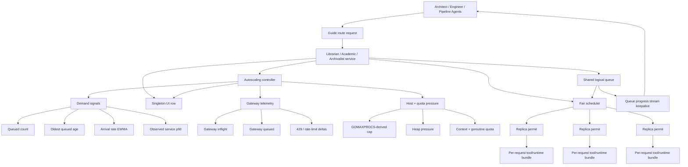
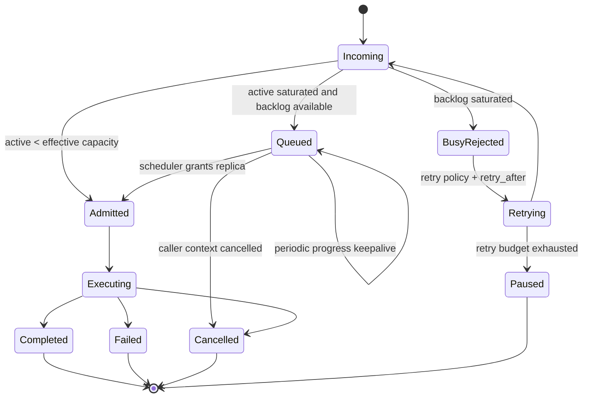
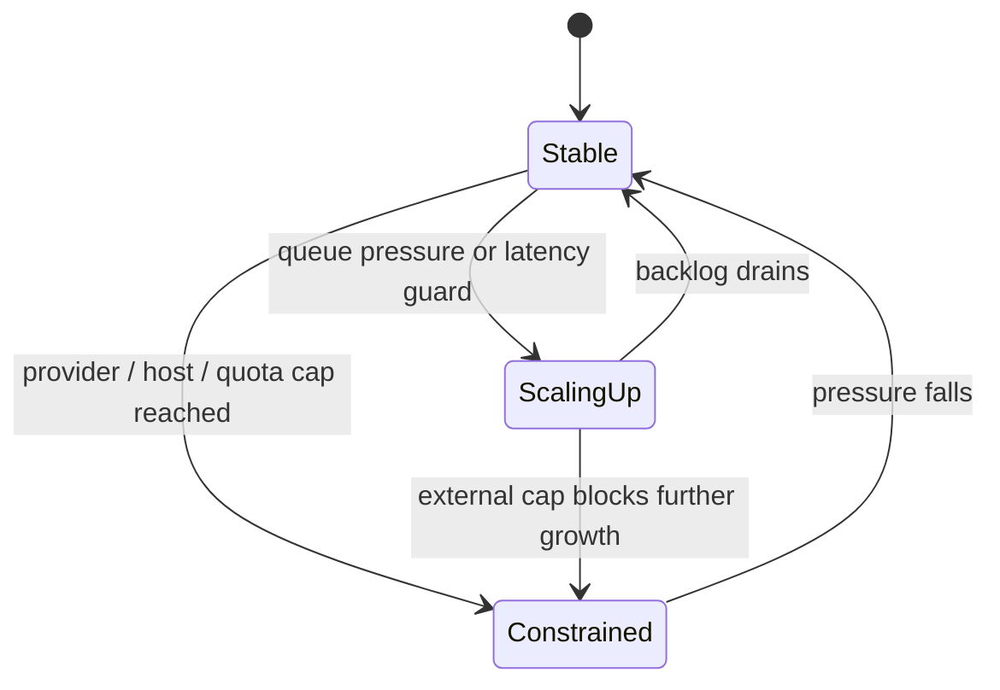

# Knowledge-Agent Autoscaling

## Purpose

Sylk’s knowledge agents (`librarian`, `academic`, `archivalist`) are shared
services. They are consulted by user-facing agents, planners, and large numbers
of concurrent pipeline workers. A fixed one-request-at-a-time model causes two
failure modes:

1. queued consults silently stall until upstream inactivity timers expire
2. overload in one hot knowledge agent cascades into unrelated pipeline failure

This document defines the autoscaling architecture implemented in the current
codebase for knowledge-agent forwarded work.

The goals are:

- zero user configuration
- scale from observed demand, not hand-tuned concurrency knobs
- respect provider and host/system limits
- keep queued requests alive with visible progress
- bound backlog growth
- degrade into retryable pause semantics instead of hard-failing consult flows
- preserve the existing UI model of one left-panel row per logical knowledge agent

## Existing Infrastructure Reused

The implementation intentionally builds on existing Sylk primitives instead of
creating a second orchestration stack.

- `agents/shared/request_replica_pool.go`
  Shared admission, queueing, scheduling, retry-after estimation, and
  autoscaling control loop.
- `core/providers/gateway/*`
  Existing provider gateway concurrency, queue, and rate-limit telemetry.
- `core/container/resource_quota.go`
  Existing aggregate context-window and goroutine pressure accounting.
- `agents/*/(academic|librarian|archivalist).go`
  Existing forwarded-request handling, stream lifecycle, progress publishing,
  and per-request tool-runtime cloning.
- `ui/agent/*`
  Existing singleton logical-row rendering with `xN` / `qN` replica-load suffixes.

## Service Model

Each knowledge agent is treated as one logical service with many in-process
replicas behind it.

- One logical service queue per agent type.
- One shared scheduler per logical service.
- Replicas are **dynamic concurrency permits plus per-request tool/runtime
  bundles**, not heavyweight external pods.
- There is no separate user-configured replica count.
- The left panel shows one canonical row for the service, not one row per replica.

This intentionally resembles Kubernetes at the service level while matching the
actual in-process Sylk runtime.

## Architecture



## Replica Semantics

In this runtime, a “replica” is not a separate OS process or container.
Instead, a replica is:

- an admission slot granted by the shared controller
- a per-request cloned tool registry / runtime bundle
- a dedicated forwarded-request execution context

This matters because scale-up does not require slow cold-starts. The controller
can raise effective concurrency immediately when system/provider headroom exists.

Because of that, the current runtime collapses Kubernetes-style `Pending` and
`Starting` into “queued, waiting for admission” and “admitted, actively
executing”.

## Request Lifecycle



## Controller State



## Scheduling Policy

The queue is global to the logical knowledge service.

### Priority

Priority is derived from request behavior, not user configuration.

- direct user-facing forwarded work: highest
- top-level routed work from other agents: medium-high
- nested consult/challenge work: lower

### Fairness

The queue uses source-aware fair scheduling.

- Requests are grouped by a `SourceKey`.
- Within the highest priority band, grants rotate by source instead of draining
  one source completely.
- `SourceKey` is derived from:
  - `pipeline_id`
  - else `task_id`
  - else `session_id`
  - else `source_agent_id`

This prevents one noisy pipeline from monopolizing a shared knowledge agent.

### Work Weighting

Backlog pressure is based on weighted work, not raw request count.

The current implementation estimates request cost from:

- prompt byte length
- dependency/context complexity hints
- co-agent/context metadata count

This is intentionally lightweight and zero-config.

## Autoscaling Policy

The controller recomputes effective capacity on a periodic control tick.

### Demand Signals

- arrival-rate EWMA
- weighted queued work
- oldest queued age
- observed service-time p90

### Provider Signals

From the existing gateway wrapper:

- inflight requests
- gateway queue depth
- static gateway max concurrency
- static gateway max queue
- recent rate-limit / 429 deltas

### Host + System Signals

- `GOMAXPROCS`-derived CPU cap
- runtime heap pressure (`heap_alloc / heap_goal`)
- aggregate `ResourceQuota` goroutine headroom
- aggregate `ResourceQuota` context-window pressure

### Desired Replica Target

The controller computes desired concurrency from:

```text
steady_state = ceil(arrival_rate * service_p90 / target_utilization)
drain_need   = ceil(weighted_queue * service_p90 / drain_window)
latency_need = extra scale when oldest_queue_age exceeds queue_target_age

desired = max(
  active,
  steady_state,
  active + drain_need,
  active + latency_need,
  active + 1 when any queue exists
)
```

### Hard Capacity Cap

Desired concurrency is then clamped by live caps:

```text
hard_cap = min(
  cpu_cap,
  provider_cap,
  quota_cap,
  memory_pressure_cap,
  optional explicit hard overrides
)
```

Important behaviors:

- memory pressure throttles or freezes scale-up
- gateway queue / 429 pressure throttles or freezes scale-up
- quota pressure stops growth when aggregate context or goroutine headroom is low

## Queue Backlog Policy

Backlog is bounded.

The queue cap is derived automatically from effective service capacity:

```text
queue_cap = max(queue_floor, max(desired, hard_cap) * queue_scale_factor)
```

Then clamped by:

- gateway queue ceilings
- optional explicit hard queue cap

This avoids unbounded backlog growth while still giving the controller enough
buffer to absorb bursts.

## Timeout and Busy Semantics

### Queued Requests Must Not Time Out

Queued requests publish progress stream activity periodically while waiting for
admission. That activity resets the upstream synchronous inactivity timers.

This is the critical change that prevents “waiting behind another consult”
from looking like a dead request.

### Saturated Backlog

If the queue is already full:

1. the service rejects the request as retryable busy
2. the busy response includes load and retry-after metadata
3. the caller retries with bounded exponential backoff, honoring the larger of:
   - the route retry policy delay
   - the service-estimated `retry_after`
4. if retry budget is exhausted, the caller degrades into a delegated pause
   instead of hard-failing the consult flow

For user-facing consult flows, this produces:

- “agent is busy”
- “I’ve paused instead of failing”
- “Do you want me to keep waiting and retry?”

## UI Model

The left panel intentionally shows one row per logical knowledge service.

Example:

```text
Librarian x4 q7
Academic x2 q3
Archivalist x1
```

Meaning:

- `xN`: currently active admitted replicas
- `qN`: queued requests waiting for admission

This preserves the mental model of one knowledge service while still exposing
live autoscaling pressure.

## Implementation Map

### Shared Controller

- `agents/shared/request_replica_pool.go`
  - queue
  - fair scheduler
  - autoscaling control loop
  - host/provider/quota caps
  - retry-after estimation

### Busy / Retry Surface

- `agents/shared/consultation_busy.go`
  - busy response payloads
  - retry-after propagation
  - delegated pause message

### Knowledge Agents

- `agents/librarian/librarian.go`
- `agents/academic/academic.go`
- `agents/archivalist/archivalist.go`

Each agent:

- creates one autoscaling `RequestReplicaPool`
- passes provider telemetry from the gateway-wrapped provider
- passes global `ResourceQuota`
- attaches queue keepalive progress updates
- records execution observations on lease release

### Bootstrap Wiring

- `cmd/tui.go`

Threads the existing global `ResourceQuota` into knowledge-agent configs so the
autoscaler is driven by actual system pressure instead of local per-agent guesses.

## Explicit Non-Goals

These are intentionally not part of the current implementation:

- user-configured concurrency knobs as the primary policy
- per-replica left-panel rows for knowledge agents
- heavyweight process/container spin-up for knowledge replicas
- unbounded backlog buffering

## Operational Summary

The implemented design is:

- one logical knowledge-agent service
- one bounded fair queue per service
- dynamic in-process replicas
- autoscaling from demand + provider + host pressure
- queue keepalives to prevent inactivity timeout
- retryable busy with retry-after hints
- delegated pause instead of hard consult failure when retries exhaust

That gives Sylk the practical equivalent of service-level autoscaling and
load-shedding without introducing a separate external scheduler.
