# Communication Architecture

## Purpose

Sylk needs one communication architecture that can handle all of the following
without falling back to brittle prompt tricks:

- long-lived conversations that survive hours, days, restarts, and handoffs
- live steering of in-flight agent work
- rollback and branching of conversation history
- deterministic workflow/protocol progression
- agentic routing that still adapts when the user shifts direction
- direct inter-agent communication with visible tree semantics
- broad-but-bounded awareness propagation across agents and pipelines
- concurrent pipeline coordination without blocking worker autonomy

This document defines that architecture.

It is intentionally designed to reuse existing Sylk infrastructure before
introducing anything new:

- Guide/EventBus for live message transport
- steering WAL + mailbox for live control
- durable protocol logs + reducer-backed mailboxes
- Ristretto + SQLite state tiers
- Archivalist as historical/semantic memory
- scribe sidecars as low-authority narrative observers
- existing inter-agent branch metadata and chat tree rendering
- coordination ledger/watch flows for pipeline workers

## Design Goals

- deterministic where workflow correctness requires it
- agentic where routing, synthesis, and adaptation benefit from judgment
- durable and replayable
- crash-tolerant
- low-latency for active steering
- scalable to many concurrent agents and pipelines
- storage-efficient
- queryable for resume, branch, rollback, and batching
- explicit separation between truth, projection, and advisory summary

## Non-Goals

- replacing the Guide with a pure rules engine
- replacing Archivalist with the authoritative live conversation store
- treating scribe summaries as truth
- using prompt injection as the primary workflow enforcement mechanism
- forcing all communication through a single giant SQL row or giant transcript blob

## Core Principle

Communication is not one thing. Sylk has several distinct communication
problems, and each needs the correct durability and authority boundary.

The correct model is a layered system:

1. live transport
2. authoritative event logs
3. deterministic reducers
4. derived mailbox obligations
5. query projections and caches
6. semantic/history enrichment
7. advisory narrative/trajectory support

## Existing Infrastructure Reused

### Live Transport

- `agents/guide/*`
- `guide.EventBus`
- request / response / stream / action messages

Use:

- low-latency delivery
- fanout
- active streaming
- direct communication transport
- steering and coordination notifications

### Agent-Local Steering

- [`core/steering/wal.go`](/home/alundhe/Projects/sylk/core/steering/wal.go)
- [`core/steering/mailbox.go`](/home/alundhe/Projects/sylk/core/steering/mailbox.go)
- [`agents/shared/steering_manager.go`](/home/alundhe/Projects/sylk/agents/shared/steering_manager.go)

Use:

- live user steering
- cancel / pause / resume / inject / rollback control
- agent-local crash recovery

### Durable Protocol State

- [`docs/DURABLE_PROTOCOLS.md`](/home/alundhe/Projects/sylk/docs/DURABLE_PROTOCOLS.md)
- [`agents/shared/durable_protocol_log.go`](/home/alundhe/Projects/sylk/agents/shared/durable_protocol_log.go)
- [`agents/shared/durable_agent_mailbox.go`](/home/alundhe/Projects/sylk/agents/shared/durable_agent_mailbox.go)

Use:

- pipeline/global-review workflow truth
- durable obligations
- reducer-backed mailbox derivation

### Hot/Warm/Cold State Tiers

- [`docs/SYSTEM.md`](/home/alundhe/Projects/sylk/docs/SYSTEM.md)

Use:

- Ristretto for hot projections
- ring/buffer tiers where applicable
- SQLite for durable queryable projections

### Archival Semantic Memory

- [`agents/shared/archivalist_brief_source.go`](/home/alundhe/Projects/sylk/agents/shared/archivalist_brief_source.go)
- [`docs/MEMORY_FOREST.md`](/home/alundhe/Projects/sylk/docs/MEMORY_FOREST.md)

Use:

- historical briefing
- cross-session preference/decision recall
- semantic memory promotion

### Scribe Sidecars

- [`agents/shared/agent_pod.go`](/home/alundhe/Projects/sylk/agents/shared/agent_pod.go)
- [`docs/MEMORY_FOREST.md`](/home/alundhe/Projects/sylk/docs/MEMORY_FOREST.md)

Use:

- dense episodic capture
- low-cost rationale preservation
- trajectory and shift hypotheses
- replay-friendly narrative hints

### Pipeline Coordination

- [`agents/shared/pipeline_coordination.go`](/home/alundhe/Projects/sylk/agents/shared/pipeline_coordination.go)

Use:

- deterministic concurrent worker awareness
- claims, artifacts, reviews, watches
- non-blocking peer progress visibility

### Direct Communication UI/Transport Shape

- [`agents/shared/inter_agent_branch.go`](/home/alundhe/Projects/sylk/agents/shared/inter_agent_branch.go)
- [`agents/shared/guide_route_sync.go`](/home/alundhe/Projects/sylk/agents/shared/guide_route_sync.go)
- [`ui/chat/inter_agent_tool.go`](/home/alundhe/Projects/sylk/ui/chat/inter_agent_tool.go)
- [`ui/chat/model.go`](/home/alundhe/Projects/sylk/ui/chat/model.go)

Use:

- consult/challenge/approval tree semantics
- nested inter-agent branch identity
- visible parent/child execution tree

## The Seven Planes

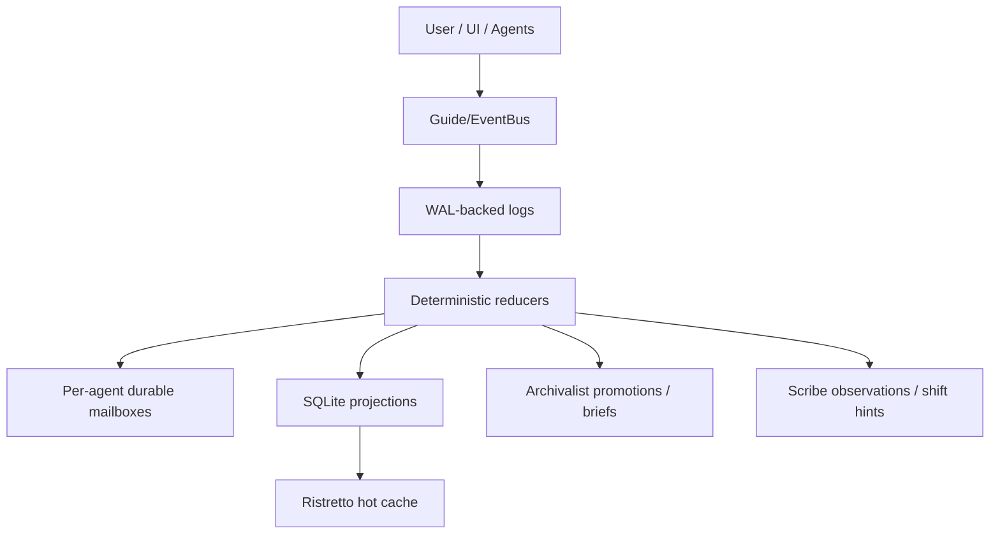

### 1. Live Transport Plane

The bus is for delivery, not truth.

Responsibilities:

- carry request / response / stream / action messages
- enable immediate low-latency routing
- support direct communication trees
- propagate live steering
- publish coordination updates

The bus may lose timing, ordering across topics, or in-memory state after a
restart. That is acceptable because it is not the source of truth.

### 2. Authoritative Event Plane

The authoritative truth of communication is append-only WAL-backed event logs.

There are three families of logs:

- conversation log
- agent mailbox log
- protocol log

Protocol log already exists for pipeline/global-review.
This document adds the conversation log as the missing peer.

### 3. Reducer Plane

Reducers deterministically derive:

- active transcript state
- branch and rollback state
- routing hints and conversation ownership
- open obligations
- awareness digests
- resume packets
- batch state
- unresolved direct-communication work

Reducers are the only component allowed to answer:

- what is the active conversation branch?
- what must happen next?
- what is retracted versus visible?
- which agents should be aware of the current direction?

### 4. Mailbox Plane

Each agent has a durable mailbox with multiple logical lanes.

Suggested lanes:

- `control`
- `conversation`
- `protocol`
- `awareness`
- `batch`
- `coordination`

Mailbox items are derived and convergent, not independently authoritative.

### 5. Projection Plane

SQLite-backed projections provide queryable state:

- current conversation head
- branch graph
- active ownership/routing hints
- latest summarized state per conversation
- batch aggregates
- awareness digests
- rollback shadow sets
- unresolved direct-communication edges

### 6. Semantic Memory Plane

Archivalist stores promoted historical knowledge:

- durable preferences
- decisions
- outcome summaries
- cross-session patterns
- replay briefs

Archivalist is not the live source of truth for current conversation state.
It enriches the reducer and resume flow.

### 7. Advisory Narrative Plane

Scribes provide:

- episodic summaries
- shift hypotheses
- rationale compression
- narrative continuity hints

Scribes never outrank the authoritative logs or reducers.

## Storage Layout

The communication system should use per-session storage with separate ownership
boundaries for agent-local and shared communication truth.

```text
.sylk/sessions/<session_id>/
  conversations/
    <conversation_id>/
      wal/
        events-*.wal
      branches/
        <branch_id>/
          snapshot.json
      state.db

  protocols/
    pipeline/<task_id>/...
    global_review/<review_id>/...

  agents/
    <agent_id>/
      wal/
      mailbox/
        mailbox-*.wal
      checkpoints/

  projections/
    communication.db

  cache/
    resume/
    awareness/
```

### Authoritative vs Derived

Authoritative:

- conversation WAL
- per-agent mailbox WAL
- protocol WAL

Derived:

- SQLite projections
- JSON snapshots
- Ristretto caches
- Archivalist promoted summaries
- scribe outputs

## Conversation Event Log

The new conversation log is the authoritative source of live conversational
truth across turns and branches.

### Partitioning

- partition key: `conversation_id`
- secondary branch key: `branch_id`
- causality via `parent_event_id`
- actor identity via `source_agent_id`, `target_agent_id`, `user_id/system`

### Core Event Types

#### User / Session Events

- `conversation_started`
- `user_message_submitted`
- `user_message_retracted`
- `conversation_paused`
- `conversation_resumed`
- `conversation_checkpoint_created`
- `conversation_branch_created`
- `conversation_branch_activated`
- `conversation_branch_merged`

#### Agent Turn Events

- `agent_turn_started`
- `agent_progress_recorded`
- `agent_turn_completed`
- `agent_turn_failed`
- `agent_turn_cancelled`
- `agent_handoff_started`
- `agent_handoff_completed`

#### Steering Events

- `steer_submitted`
- `steer_applied`
- `steer_rejected`
- `rollback_requested`
- `rollback_applied`

#### Direct Communication Events

- `direct_request_started`
- `direct_request_rerouted`
- `direct_stream_started`
- `direct_result_received`
- `direct_result_consumed`
- `direct_request_failed`
- `direct_request_cancelled`

#### Batch Events

- `batch_started`
- `batch_target_completed`
- `batch_target_failed`
- `batch_aggregate_ready`
- `batch_closed`

#### Awareness Events

- `awareness_digest_published`
- `awareness_digest_consumed`
- `awareness_digest_expired`

#### Coordination Events

- `coordination_claim_published`
- `coordination_artifact_published`
- `coordination_review_requested`
- `coordination_review_resolved`
- `coordination_watch_fired`

## Direct Communication Integration

Direct communication must be a first-class part of the communication
architecture, not a transport-only side path.

### Why

Without durable direct-communication facts:

- resume loses important consult/challenge context
- rollback cannot cleanly retract derived child work
- branching from before a consult is ambiguous
- parent agents can get stuck in synthetic “waiting for child work” states
- awareness and routing miss what was actually explored

### Rule

Every direct inter-agent exchange participates in:

1. live transport on the bus
2. conversation truth in the conversation WAL
3. protocol truth when the exchange belongs to a formal protocol

### Direct Communication Flow

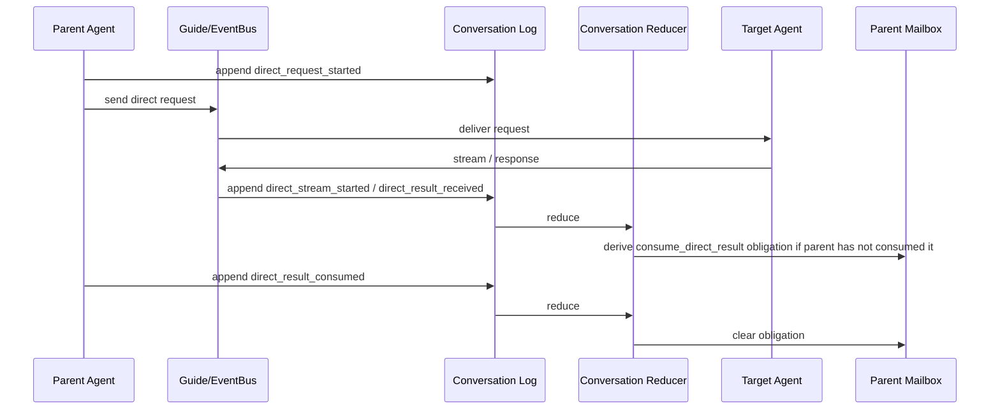

### Identity

Direct-communication events should reuse the existing inter-agent identity
fields already carried through stream metadata:

- `correlation_id`
- `parent_correlation_id`
- `thread_key`
- `branch kind`
- `source_agent_id`
- `target_agent_id`

This avoids inventing a parallel identity scheme.

## Per-Agent Mailbox Architecture

The mailbox should evolve from a single bounded steering ring into a durable,
partitioned, Kafka-esque per-agent log with reducer-derived pending state.

### Mailbox Semantics

- append-only durable mailbox WAL
- item keys for idempotency
- consumer offsets or ack watermark
- at-least-once delivery
- convergent sync for derived obligations

### Mailbox Lanes

```text
control
conversation
protocol
awareness
batch
coordination
```

### Lane Responsibilities

`control`
- pause
- cancel
- rollback to checkpoint
- immediate steer

`conversation`
- respond to user follow-up
- consume direct child result
- resume from checkpoint

`protocol`
- process_validation
- finalize_pipeline
- handoff_to_green
- global review equivalents

`awareness`
- low-priority digest updates
- relevance-triggered prework hints

`batch`
- per-target batch obligations
- final aggregation readiness

`coordination`
- claims / reviews / artifact consumption

## Reducers And Projections

The communication reducer should maintain a set of deterministic projections.

## Projection Set

### 1. Transcript Projection

Visible conversation as the user should see it on the active branch.

Contains:

- visible user/agent messages
- visible direct communication summaries
- shadowed/retracted ranges
- branch head

### 2. Operational Conversation Projection

Full state needed for resume, routing, rollback, and direct communication.

Contains:

- active child work
- unresolved direct-result consumption
- in-flight agent turns
- current agent ownership set
- batch state
- handoff state

### 3. Routing Projection

Guide-facing hints:

- continuity bias
- shift score
- specialist relevance weights
- unresolved ask clusters
- recent direct-communication evidence
- user-focus trajectory

### 4. Resume Projection

Agent-facing resume packets:

- what happened recently
- what is still active
- what was last known intent
- what direct child results remain unconsumed
- what branch is active

### 5. Awareness Projection

Specialization-scoped digests:

- engineering changes
- design/UX direction
- testing risk
- architectural trajectory
- governance constraints
- research trajectory

### 6. Branch Projection

Branch graph and shadow state:

- branch ancestry
- anchor event
- active branch
- merge points
- retracted descendants

### 7. Batch Projection

- targets
- partial completions
- failed targets
- aggregation policy
- combined update readiness

## State Machines

### Conversation Lifecycle

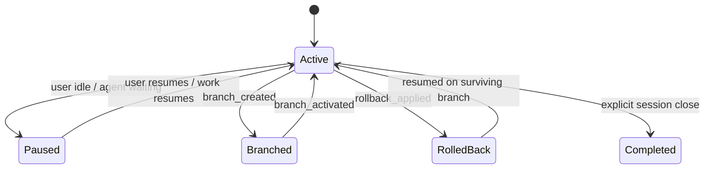

### Agent Turn Lifecycle

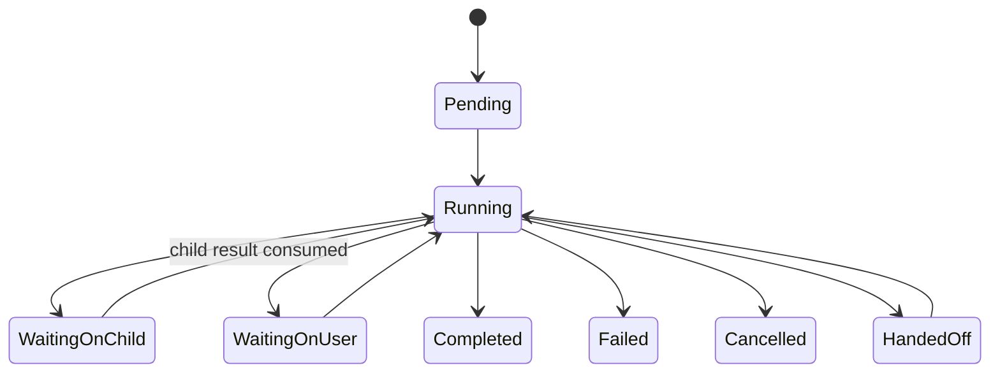

### Steering Lifecycle

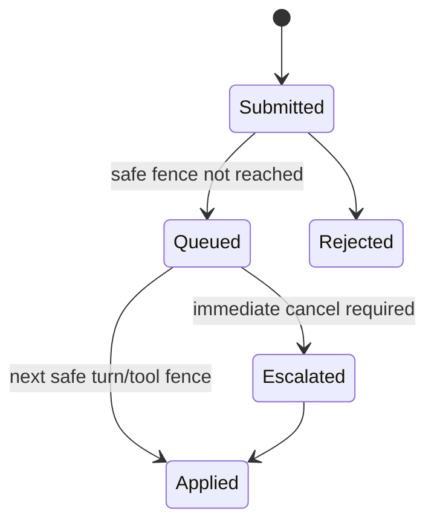

### Direct Communication Lifecycle

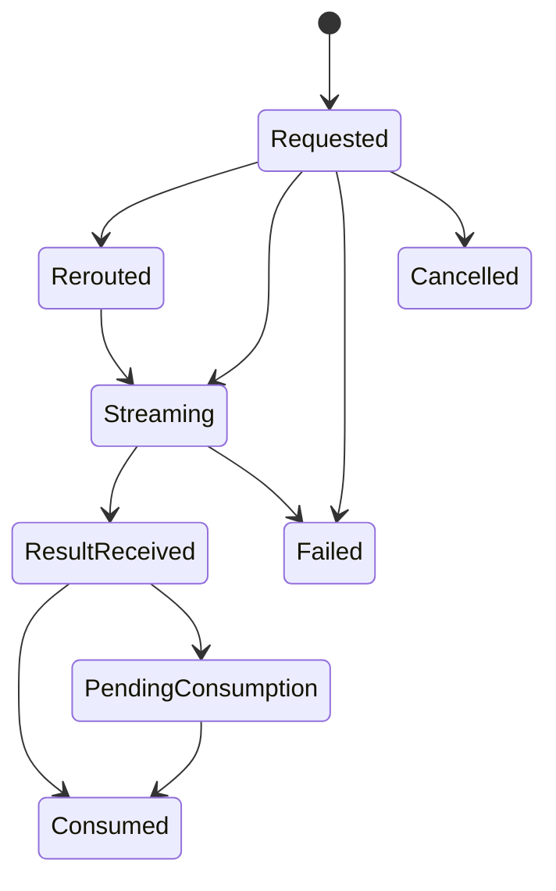

### Batch Messaging Lifecycle

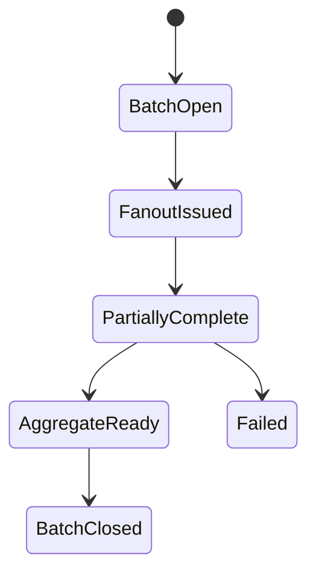

## Routing: Deterministic + Agentic Balance

Guide should remain intent-driven, but consume reducer-derived hints.

### Deterministic Inputs

- active branch head
- latest user-visible message
- rollback/shadow state
- explicit target selection
- open protocol obligations
- unresolved direct child work
- batch state

### Agentic Inputs

- intent classification
- shift detection
- specialist relevance
- scribe shift hypotheses
- archival historical preferences
- agent confidence and recent evidence coverage

### Rule

Deterministic state constrains the search space.
Agentic routing chooses inside that constrained space.

Guide should never infer continuity solely from transient memory if the
conversation reducer already knows the authoritative current branch/head.

## Resume And Recovery

### Resume Flow

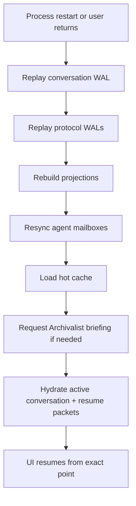

### Exact Resume Semantics

To satisfy “user walks away for hours or days”:

- active conversation branch/head must be durable
- open agent turns must be durable
- unresolved child communication must be durable
- pending protocol obligations must be durable
- last visible transcript state must be derivable
- resume packet generation must be fast from snapshot + replay

Archivalist may enrich resume, but resume must still work without it.

## Rollback

Rollback should be causal and branch-aware, not destructive.

### Principle

Rollback appends events. It does not erase history.

### Rollback Flow

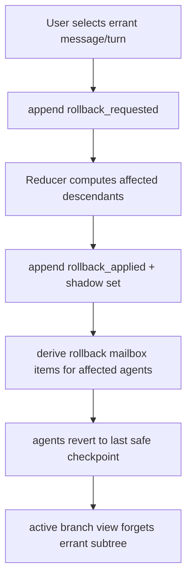

### What Must Be Retained

- the system remembers the rollback happened
- audit history keeps the old subtree
- active branch hides the shadowed subtree
- other unaffected history remains visible and usable

## Branching

Branching should be first-class.

### Branch Flow

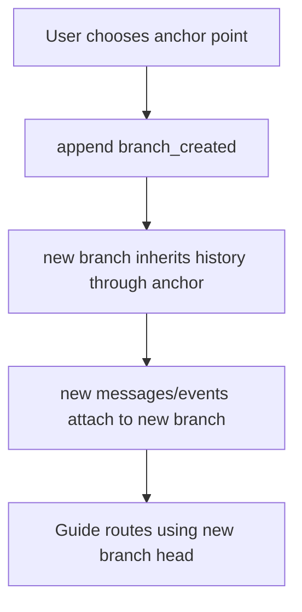

### Branch Guarantees

- no destructive mutation of the source branch
- mailbox obligations derived per active branch
- direct communication descendants remain attached to the branch that spawned them
- merge is explicit, not implicit

## Batch Messaging

Batch messaging is not just “send to many agents.” It needs state.

### Batch Model

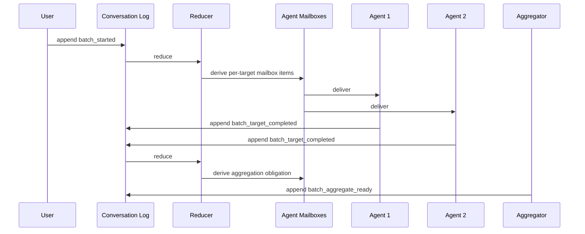

### Aggregation Policy

Support:

- wait for all
- quorum
- fastest-N
- timeout + partial aggregate
- explicit user-triggered early aggregate

## Live Steering

Live steering must remain low-latency and minimally disruptive.

### Steering Policies

`advisory`
- apply at next safe tool/LLM fence
- do not cancel in-flight work

`mutating`
- apply at next safe fence
- may alter upcoming tool choices or response

`destructive`
- cancel current work
- rollback to checkpoint
- resume from prior preserved state

### Safe Fences

- before next tool call
- before next LLM request
- after current child result is consumed
- immediate, when cancel is explicitly required

### Steering Flow

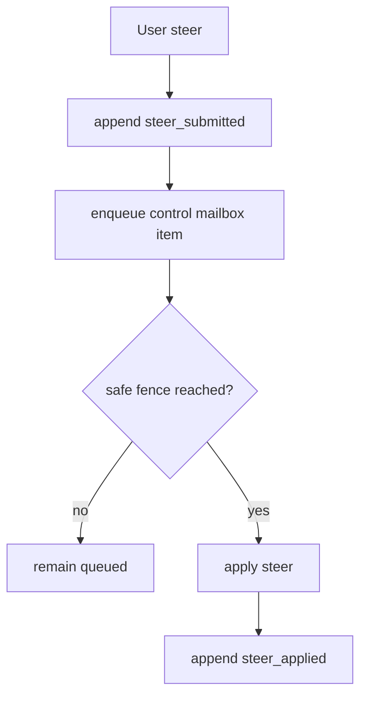

## Awareness Propagation

The system should allow broad but bounded awareness without flattening all
agents into a single shared consciousness.

### Principle

Agents receive digestible, specialization-scoped awareness, not full raw
transcript flood.

### Awareness Sources

- latest conversation direction
- direct communication outcomes
- pipeline coordination milestones
- protocol state transitions
- user-stated priorities / constraints
- Archivalist preference memory
- Scribe shift hypotheses

### Awareness Targets

- Architect: architecture, tradeoff, plan changes
- Engineer: implementation and tooling direction
- Designer: UX/product/aesthetic direction
- Tester: validation trajectory and toolchain risk
- Inspector: review criteria and decision trajectory
- Academic/Librarian/Archivalist: evidence/research/history demand shaping
- Guardian: safety and approval implications

### Delivery Model

Awareness is delivered through the `awareness` mailbox lane and hot cache
projection, not as mandatory turn-blocking work.

### Rules

- awareness cannot override explicit tasks
- awareness cannot block protocol obligations
- awareness can trigger low-cost prework when idle or highly relevant
- awareness is TTL-bound and refreshed incrementally

## Scribes

Scribes should be integrated as advisory producers only.

### Scribe Responsibilities

- dense episodic capture
- trajectory summarization
- shift hypothesis generation
- rationale preservation

### Scribe Constraints

- no authority over routing
- no authority over protocol progression
- no authority over rollback truth
- no direct mailbox obligations except their own sidecar maintenance

### Scribe Output Uses

- routing hint feature
- awareness digest enrichment
- Archivalist promotion candidate
- resume narrative enrichment

## Archivalist

Archivalist should integrate as semantic memory and briefing service.

### Archivalist Responsibilities

- promote important conversation outcomes
- answer historical / preference / prior-decision questions
- provide context briefs for handoff/resume
- store cross-session durable semantic memory

### Archivalist Constraints

- not the live conversation truth source
- not the direct source for rollback/branch causality
- not the only resume mechanism

## Concurrent Pipeline Agents

Conversation architecture must not replace the coordination ledger.

### Correct Division

Use coordination ledger for:

- live claims
- review requests
- artifact availability
- non-blocking watches

Use conversation architecture for:

- higher-level narrative and user-visible progress
- reduced awareness digests
- branch/rollback/resume across broader conversation context

### Pipeline Flow

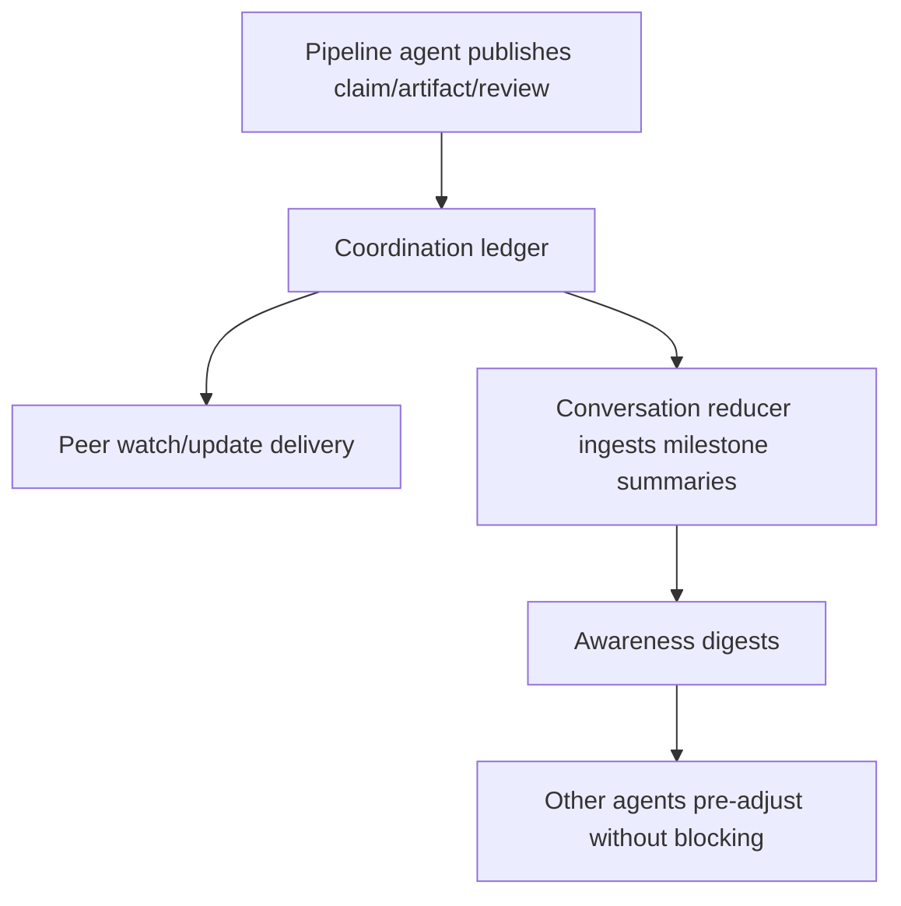

This keeps worker coordination deterministic and fast while still feeding the
broader communication state.

## Scenario Coverage

### 1. User leaves for hours or days

Required:

- conversation WAL replay
- branch/head restore
- mailbox restore
- protocol restore
- resume packet rebuild
- optional Archivalist briefing

### 2. User rolls back an errant prompt

Required:

- append-only rollback events
- causal subtree shadowing
- rollback mailbox items
- checkpoint-based agent recovery

### 3. User branches from a prior point

Required:

- branch event + branch graph
- active branch projection switch
- per-branch mailbox derivation

### 4. Batch message agents and aggregate

Required:

- batch event family
- per-target mailbox fanout
- reducer-tracked aggregation

### 5. Steering injected at next tool turn

Required:

- control mailbox lane
- safe-fence semantics
- checkpoint-aware rollback for destructive steer

### 6. Broad awareness without role collapse

Required:

- awareness projection
- specialization-scoped digests
- bounded TTL and precedence rules

### 7. Concurrent pipeline agents aware of each other

Required:

- coordination ledger for operational truth
- awareness digest mirroring for broader context
- no blocking cross-worker dependency except explicit review/claim semantics

## Correctness Rules

- WAL logs are authoritative
- reducers are deterministic and replay-safe
- mailbox items are derived, convergent, and disposable
- SQLite is projection storage, not source of truth
- Ristretto is hot cache only
- direct communication always enters the conversation log
- protocol communication enters both conversation truth and protocol truth
- rollback shadows history; it does not erase it
- branching is explicit
- Archivalist enriches, not authoritatively governs, active conversation state
- scribes advise, not decide
- awareness cannot override explicit tasks or protocol obligations

## Performance Strategy

- WAL append on write path
- reducer snapshots to avoid full replay on every request
- Ristretto for hot projection access
- SQLite for query-heavy projection reads
- mailbox sync only for changed obligations
- summarize pipeline/coordination events before promoting into conversation state
- TTL-bound awareness digests
- bounded Archivalist promotion queues
- bounded Scribe output ingestion with lower authority weighting

## Implementation Shape

### New Authoritative Subsystem

- `conversation WAL`
- `conversation reducer`
- `communication SQLite projections`
- `conversation mailbox derivation`

### Existing Subsystems To Reuse Directly

- Guide/EventBus
- steering WAL/mailbox
- durable protocol logs
- Archivalist briefing
- scribe sidecars
- coordination client/ledger
- handoff/resume packet mechanisms

### Preferred Storage Strategy

Authoritative:

- WAL-backed append-only logs

Derived:

- SQLite projections
- Ristretto hot cache
- Archivalist promoted summaries

This follows the same pattern now used in durable protocol communication and
avoids promoting SQLite or summaries into the role of workflow truth.

## Summary

The correct communication system for Sylk is:

- bus for transport
- WAL for truth
- reducers for deterministic state
- per-agent mailbox for durable obligations and control
- SQLite + Ristretto for query speed
- Archivalist for semantic memory
- Scribes for advisory narrative support
- coordination ledger for concurrent pipeline operations
- direct communication integrated as a first-class event stream

That is the only shape that simultaneously gives:

- exact resume
- rollback
- branching
- batching
- live steering
- broad awareness
- concurrent pipeline coordination
- durable, replayable, agentic communication
