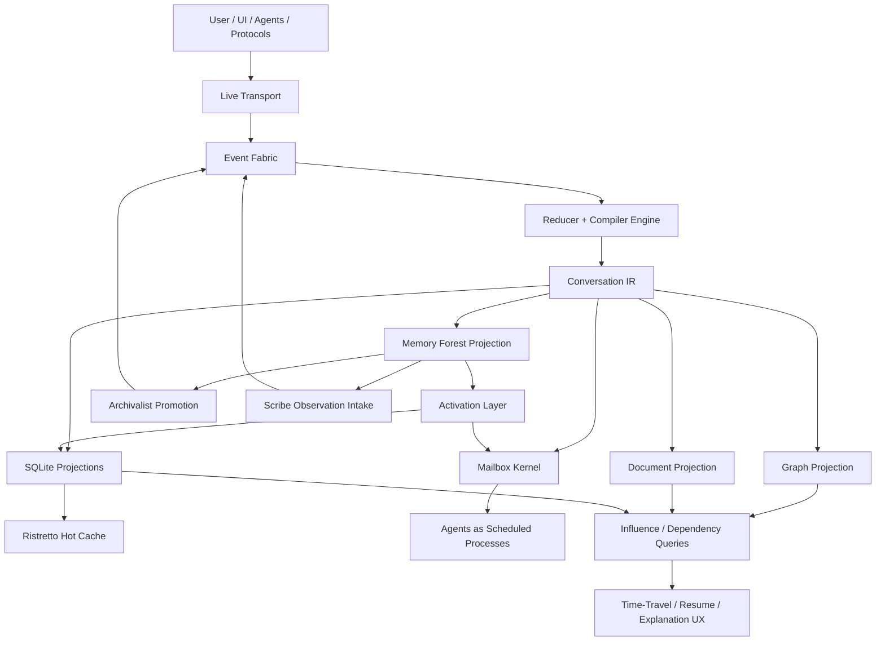
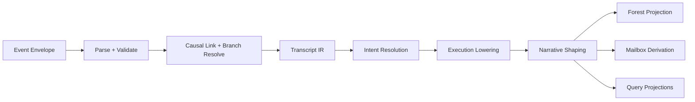
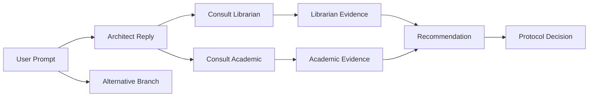
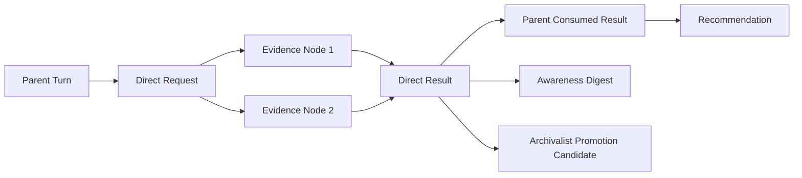
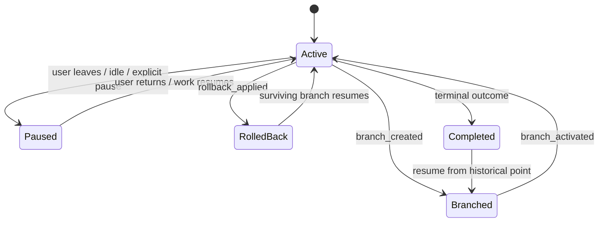
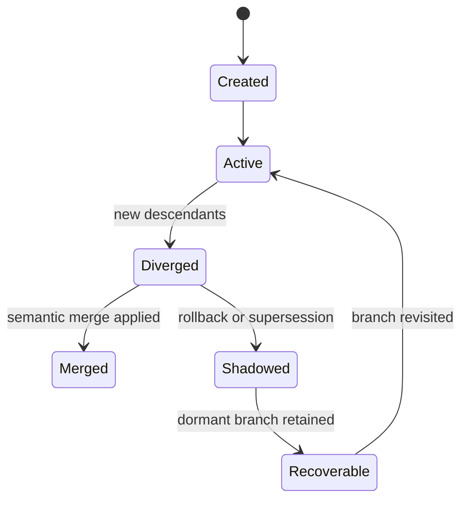
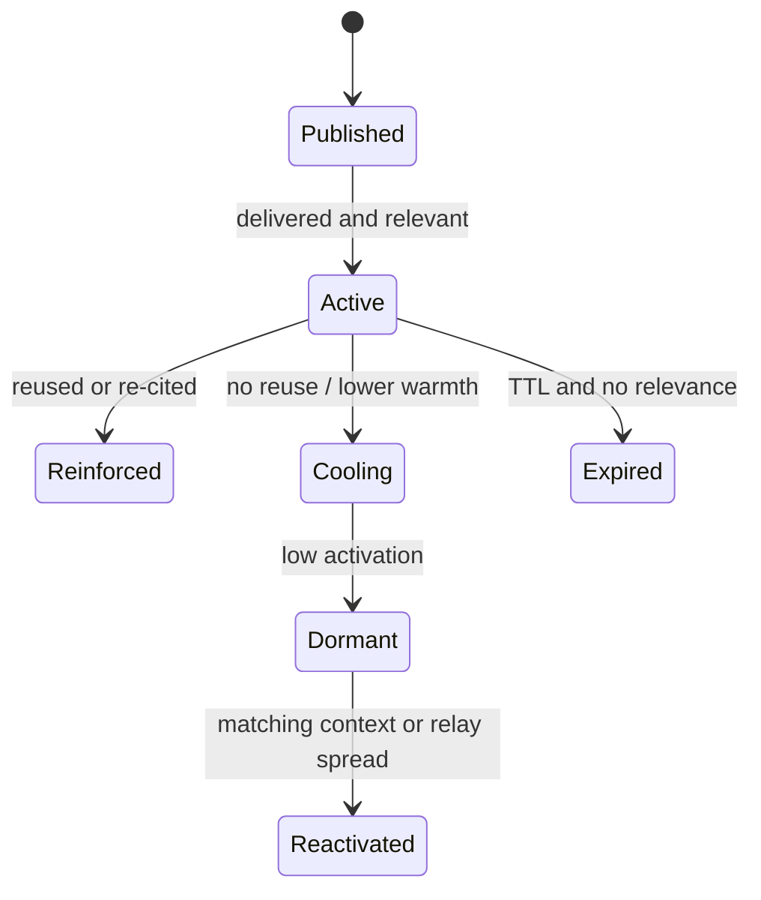
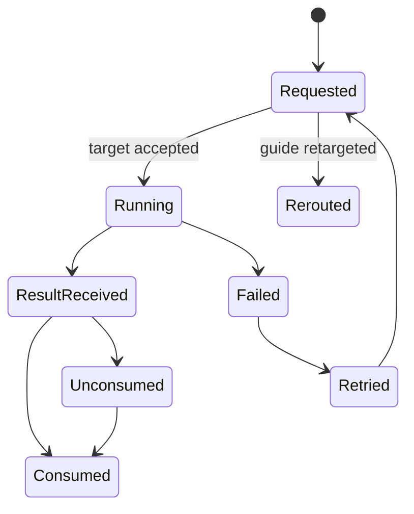
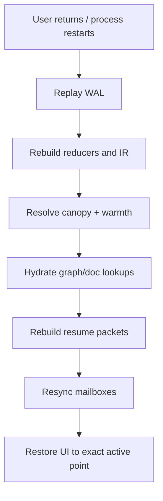
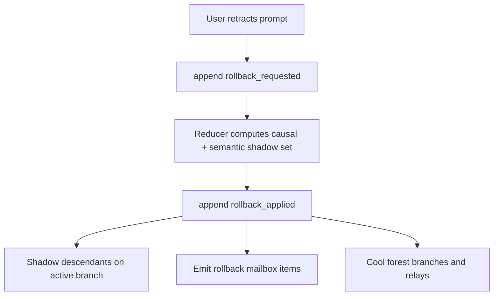

# Conversation Architecture

## Purpose

Sylk needs a conversation system that behaves less like a mutable chat log and
more like a durable, branchable, replayable operating substrate for agentic
work.

This document defines that substrate.

It extends and specializes:

- [`docs/COMMUNICATION.md`](/home/alundhe/Projects/sylk/docs/COMMUNICATION.md)
- [`docs/MEMORY_FOREST.md`](/home/alundhe/Projects/sylk/docs/MEMORY_FOREST.md)
- [`docs/DURABLE_PROTOCOLS.md`](/home/alundhe/Projects/sylk/docs/DURABLE_PROTOCOLS.md)
- [`docs/HANDOFF.md`](/home/alundhe/Projects/sylk/docs/HANDOFF.md)

Where this document says "Memory Tree," it refers to the memory-tree/forest
architecture currently documented in
[`docs/MEMORY_FOREST.md`](/home/alundhe/Projects/sylk/docs/MEMORY_FOREST.md).

## Core Thesis

Conversation is not just transcript storage.

Conversation is:

- an append-only, replayable event fabric
- a causally versioned DAG of user, agent, protocol, steering, and direct
  communication events
- a compiler pipeline that lowers events into structured conversation IR
- a semantic memory projection into the Memory Forest
- an activation and attention system driven by canopy, relays, substrate, and
  ACT-R warmth
- a mailbox kernel that delivers durable obligations and steering at safe
  execution fences
- a queryable graph/document projection for influence tracing, branching,
  rollback, and time-travel UX

The authoritative order of truth is:

1. append-only event fabric
2. deterministic reducers and IR
3. forest/graph/document projections
4. learned activation and reranking
5. UI summaries and agent-facing narrative packets

Truth is deterministic.
Attention is adaptive.
Narrative is helpful but subordinate.

## Design Goals

- exact resume after hours, days, or process restarts
- branch, rollback, replay, and merge without destructive mutation
- deterministic workflow correctness where required
- agentic routing and adaptation where beneficial
- direct communication as a first-class dataflow graph
- low-latency steering of in-flight work
- broad but bounded awareness across agents and pipelines
- concurrent pipeline progress sharing without blocking
- explainability for why an agent acted, routed, recalled, or became aware
- compatibility with existing WAL, mailbox, protocol, cache, SQLite, graph,
  document, and memory-forest infrastructure

## Non-Goals

- treating transcript text as the only representation of conversation
- using prompt nudges as the primary mechanism for workflow correctness
- replacing durable protocol logs with summaries
- replacing the Guide with a pure rules engine
- making the Memory Forest authoritative over facts
- allowing learned ranking to override governance, rollback truth, or protocol
  obligations

## Relationship To Existing Systems

This architecture reuses and extends the following:

- `Guide/EventBus` for live transport
- steering WAL and mailbox for agent-local control
- durable protocol logs for workflow truth
- Ristretto and SQLite state tiers
- knowledge graph and document DB as derived projections
- Archivalist for long-term semantic memory
- Scribe sidecars for dense episodic observation
- direct communication branch metadata and chat tree rendering
- pipeline coordination ledger/watch flows

It does not replace those systems.
It gives them one shared conversation substrate.

## High-Level Architecture



## Architectural Stack

### 1. Event Fabric

The event fabric is the authoritative source of conversational truth.

It is:

- append-only
- durable
- replayable
- causally linked
- namespaced by domain
- branch-aware
- idempotent at the event level

It should unify, under one substrate:

- conversation
- steering
- direct communication
- protocol
- pipeline coordination
- handoff
- batching
- awareness publication

Each namespace may keep its own reducer and projections, but all share the same
event model, replay semantics, and branch/causality machinery.

### 2. Reducer + Compiler Engine

Reducers do more than materialize state. They compile raw events into
conversation IR.



The compiler stages are:

1. parse event envelopes and validate causality
2. group events into branches, turns, direct-comm exchanges, and protocol spans
3. compile raw facts into layered IR
4. lower obligations into agent mailboxes
5. emit graph/document/forest/query projections
6. produce resume, awareness, and UI packets

### 3. Conversation IR

Conversation IR is the program representation of the conversation.

It has four required layers.

#### Transcript IR

Literal events:

- user prompts
- assistant replies
- steering actions
- direct consult/challenge/response events
- protocol decisions
- batch messages
- handoffs
- rollback and branch events

#### Intent IR

Resolved conversational semantics:

- current goals
- constraints
- explicit and latent subgoals
- open questions
- prohibitions
- preferences
- promised deliverables
- scope boundaries

#### Execution IR

Operational state:

- active agent owner set
- pending obligations
- child work
- protocol state
- mailbox items
- batch jobs
- retry state
- speculative work

#### Narrative IR

User-facing coherence state:

- what the user currently believes is happening
- what the system has promised
- what should be explained next
- what changed since the user last engaged
- which branches are user-visible

### 4. Memory Forest Projection

The Memory Tree/Forest is the semantic topology layered over conversation IR.

It projects IR into the families defined in
[`docs/MEMORY_FOREST.md`](/home/alundhe/Projects/sylk/docs/MEMORY_FOREST.md):

- `Intent Forest`
- `Constraint Forest`
- `Evidence Forest`
- `Decision Forest`
- `Outcome Forest`
- `Preference Forest`
- `Capability Forest`
- `Opportunity Forest`
- `Conflict Forest`

The forest is not the truth source.
It is the semantic projection and adaptive retrieval structure over truth.

### 5. Activation And Attention Layer

This layer is where the frontier behavior lives.

It is composed of:

- `Canopy`
  active root set across turn/session/user/project horizons
- `Relay Graph`
  cross-tree activation links
- `Substrate Network`
  mycelial conductance, nutrient, inhibition, and frontier diffusion
- `Warmth`
  ACT-R-compatible recency/frequency/success retrieval pressure
- `Learned Reranker`
  XGBoost-like utility/risk reranking over branch packets and conversation
  candidates

This layer decides what feels cognitively alive.
It never decides what is factually true.

### 6. Mailbox Kernel

Agents are treated as userspace processes scheduled by a communication kernel.

Kernel responsibilities:

- mailbox delivery
- lane prioritization
- fairness
- cancellation
- checkpoint/restore
- branch awareness
- direct-communication routing
- speculative execution admission
- attention budget scheduling
- work-conserving execution
- interruption at safe fences

Agents remain responsible for:

- reasoning
- tool use
- local planning
- synthesis
- communication content

### 7. Query, Graph, And Document Planes

The event fabric is optimized for append and replay, not rich exploration.

So the system should maintain derived projections:

- `SQLite`
  current heads, obligations, awareness, branch graph, resume packets, routing
  hints, unresolved promises, checkpoints, and active conversations
- `Knowledge Graph`
  causality, influence, dependency, ancestry, consumption, rollback shadow, and
  awareness diffusion edges
- `Document DB`
  full payloads, tool outputs, summaries, extracted claims, evidence, decisions,
  reviewer results, and scribe observations

### 8. UI / Time-Travel Plane

The terminal UI should expose the conversation substrate rather than hiding it.

Target capabilities:

- branch graph
- replay scrubber
- resume from point
- causal descendant inspection
- rollback overlays
- pending obligations view
- awareness explanations
- direct-communication influence tree
- batch progress lattice

## Event Model

### Event Envelope

Every event in the conversation fabric should carry:

- `event_id`
- `namespace`
- `conversation_id`
- `branch_id`
- `actor_id`
- `actor_kind`
- `event_type`
- `occurred_at`
- `causal_parents[]`
- `branch_lineage[]`
- `actor_clock`
- `semantic_scope_tags[]`
- `effect_class`
- `authority_class`
- `correlation_id`
- `parent_correlation_id`
- `protocol_id`
- `checkpoint_id`
- `payload_ref`
- `document_ref`
- `graph_node_ref`

### Namespaces

At minimum:

- `conversation`
- `direct_comm`
- `protocol.pipeline`
- `protocol.global_review`
- `coordination.pipeline`
- `steering`
- `handoff`
- `batch`
- `awareness`
- `scribe`

### Effect Classes

Suggested effect classes:

- `narrative`
- `semantic`
- `operational`
- `protocol`
- `control`
- `awareness`
- `speculative`
- `rollback`
- `branching`

### Causality Model

Events should form a causally versioned DAG, not a single linear transcript.

Each event can depend on:

- prior turn events
- direct communication child events
- protocol events
- steering commands
- awareness digests
- branch creation and activation events

That enables:

- exact replay
- branch and merge
- rollback of causal subtrees
- selective forgetting
- concurrent updates without false total ordering



## Storage Topology

Conversation storage should be session-scoped, with separate ownership
boundaries for shared conversation truth and agent-local mailboxes.

```text
.sylk/sessions/<session_id>/
  conversations/
    <conversation_id>/
      fabric/
        events-*.wal
      branches/
        <branch_id>/
          checkpoints/
          snapshots/
      projections/
        conversation.db
        ristretto/
      graph/
        exported_edges/
      docs/
        payloads/
      resume/
        packets/
      awareness/
        digests/
  protocols/
    pipeline/
      <task_id>/
        events-*.wal
    global_review/
      <review_id>/
        events-*.wal
  agents/
    <agent_id>/
      wal/
      mailbox/
        mailbox-*.wal
      checkpoints/
      telemetry/
```

The storage roles are:

- WALs: authoritative truth
- SQLite: durable query/index projections
- Ristretto: hot cache only
- graph/doc stores: derived retrieval and explanation projections
- Archivalist: semantic promotion, not live truth

## Memory Forest Integration

### Why The Forest Belongs Here

Without the forest, conversation state remains too flat:

- routing overweights recency
- awareness becomes broadcast-heavy
- resume becomes transcript-centric
- rollback stays causal but not meaning-aware
- speculation becomes heuristic and brittle

The Memory Forest corrects that by turning conversation into a living semantic
topology.

### Forest Families As Conversation Structure

- `Intent Forest`
  what the user is trying to do
- `Constraint Forest`
  what must remain true
- `Evidence Forest`
  what research, code, and review established
- `Decision Forest`
  what was chosen, rejected, or superseded
- `Outcome Forest`
  what succeeded or failed
- `Preference Forest`
  how the user prefers work to be done or explained
- `Capability Forest`
  which agents, tools, and workflows are likely to succeed
- `Opportunity Forest`
  adjacent value and safe surplus work
- `Conflict Forest`
  contradictions, unresolved forks, stale assumptions

### Canopy As Conversation Focus

The canopy is the active root set across:

- turn horizon
- session horizon
- user horizon
- project horizon

It should decide:

- which branches are hot now
- which constraints dominate
- which promises and failures remain live
- which prior evidence should bias the next action

Canopy should drive:

- resume packet composition
- routing continuity
- branch foregrounding
- what the system explains first

### Relay Graph As Cross-Pollination Fabric

Relay links should connect:

- intent -> evidence
- evidence -> decision
- decision -> outcome
- intent -> capability path
- opportunity -> conflict
- branch -> agent specialization
- direct-comm result -> downstream recommendation

This is how awareness and retrieval spread without brute-force broadcast.

### Substrate / Mycelium As Diffusion Layer

The substrate network should model:

- conductance edges
- nutrient pressure
- inhibition pressure
- active frontiers
- agent-type-specific exploration potential

This allows the conversation system to:

- diffuse intent and uncertainty pressure
- bias speculative prework toward likely next branches
- inhibit unsafe or conflicting spread
- surface safe opportunities adjacent to current work

### Warmth As ACT-R Activation

Warmth is the activation layer over conversation state.

It should rank:

- branch heads
- direct-comm results
- unresolved promises
- awareness digests
- historical preferences
- Archivalist recalls
- graph neighborhoods

Warmth must not decide:

- protocol correctness
- rollback truth
- branch ancestry
- terminal actions

The following should have pinned or near-pinned activation floors:

- unresolved promises to the user
- explicit prohibitions and hard constraints
- active protocol obligations
- approvals, vetoes, and governance blocks
- active branch identity
- checkpoint and rollback markers

### XGBoost-Like Learned Reranker

The learned reranker should sit after deterministic base scoring.

It should rank:

- recall candidates
- route candidates
- awareness digests
- speculative work
- branch revisit candidates
- merge candidates
- explanation packets

It should consume features such as:

- canopy proximity
- relay mass
- substrate potential
- ACT-R warmth
- success utility
- conflict penalty
- scope safety
- caller-agent affinity
- branch family
- source authority
- session affinity

It should never replace:

- event truth
- reducer correctness
- protocol state machines
- rollback semantics
- governance checks

## Direct Communication As Dataflow Graph

Direct communication must be represented in three forms simultaneously:

1. live transport on the bus
2. authoritative direct-comm events in the fabric
3. derived graph/document projections

### Dataflow Shape

Each exchange should become:

- request node
- evidence nodes
- response node
- consumption node
- downstream dependency nodes



### Graph Responsibilities

The knowledge graph should answer:

- what influenced this?
- what depends on this?
- what should be invalidated?
- what child work remains unconsumed?
- which result reactivated this branch?

### Document Responsibilities

The document DB should store:

- full request text
- full response text
- evidence snippets
- extracted claims
- tool outputs
- install plans
- reviewer decisions
- scribe observations

### Why This Matters

This enables:

- influence tracing
- stale evidence invalidation
- selective replay
- branch-local dependency graphs
- explanation UI
- partial recomputation when upstream facts change

## Mailbox Kernel

### Core Principle

Mailboxes are execution queues, not truth stores.

Truth comes from the event fabric.
Mailbox items are derived obligations, commands, and awareness packets.

### Required Lanes

- `control`
  pause, resume, cancel, inject, rollback, branch switch
- `conversation`
  respond, continue, summarize, consume child result, resume from checkpoint
- `protocol`
  process validation, finalize, handoff, approval, governance actions
- `awareness`
  digest delivery, refresh, expiry, reactivation
- `batch`
  fanout, quorum, aggregate, combined response
- `coordination`
  pipeline progress, claims, artifact availability
- `speculation`
  low-priority prework, prefetch, precompute

### Safe Fences

Mailbox actions should apply at explicit fences:

- before next LLM turn
- before next tool call
- after current tool returns
- immediate cancel
- immediate rollback to checkpoint

### Scheduling

The kernel should support:

- QoS classes
- starvation avoidance
- work-conserving scheduling
- pinned foreground agents
- preemptible background work
- fairness across many active agents

## State Machines

### Conversation Lifecycle



### Branch Lifecycle



### Awareness Lifecycle



### Direct Communication Lifecycle



## Resume, Rollback, Branching, And Merge

### Resume

Resume should not mean "load the last N messages."

Resume must restore:

- active branch head
- unresolved obligations
- pending child work
- active protocol state
- canopy and hot branches
- strongest constraints and promises
- recent important direct-comm results
- mailbox positions
- awareness state



### Semantic Rollback

Rollback must be causal and semantic.

If the user retracts a direction, the system should:

- append rollback events
- shadow the affected subtree
- cool dependent semantic branches
- preserve unrelated valid findings
- derive rollback mailbox items for affected agents



### Branching

Every major turn should be checkpointable and branchable.

Branching should support:

- explicit named branches
- speculative branches
- auto-branching before destructive steering
- branch comparison
- branch-local mailboxes

### Merge

Merging should be semantic, not transcript concatenation.

Merge inputs:

- branch ancestry
- semantic dependencies
- forest families
- conflict sets
- protocol obligations
- unconsumed child work

Merge outputs:

- merged branch head
- retained conflict markers
- rebased mailbox obligations
- explanation packet for what changed

## Awareness And Diffusion

Awareness should be diffusive, not broadcast.

### Inputs To Awareness

- active conversation direction
- direct communication outcomes
- protocol events
- pipeline milestones
- forest relays
- substrate pressure
- agent specialization
- user emphasis

### Diffusion Rules

- every event has semantic scope
- every agent has specialization weights
- relay proximity increases spread
- substrate conductance governs reach
- conflict and governance signals inhibit spread
- scribe-originated signals have lower authority
- guardian-originated signals have stronger inhibition effect

### What Awareness Can And Cannot Do

Awareness can:

- trigger low-cost prework
- change retrieval priority
- bias routing
- raise likely relevance

Awareness cannot:

- override explicit tasks
- override protocol obligations
- override rollback truth
- create authoritative decisions on its own

## Query Engine

The conversation system should expose graph-like and SQL-like queries.

Examples:

- show unresolved promises to the user
- show branches created after this turn
- show consults that influenced the current recommendation
- show what changed since the user left
- show why Guide routed to Architect
- show why this agent is aware of this request
- show all descendants shadowed by this rollback

The query engine should read from:

- SQLite projections
- graph indexes
- document references
- forest branch packets

## Agent Skill Surface

Agents should not manually reconstruct conversation state.

At minimum, the conversation system should expose:

- `conversation_get_resume_packet`
- `conversation_get_active_branch`
- `conversation_get_unresolved_promises`
- `conversation_get_pending_child_work`
- `conversation_branch_from_here`
- `conversation_rollback_scope`
- `conversation_explain_routing`
- `conversation_explain_awareness`

The Memory Forest skill surface should remain available:

- `forest_resolve_intent`
- `forest_recall`
- `forest_predict_next_branches`
- `forest_record_outcome`
- `forest_get_constraints`
- `forest_get_conflicts`
- `forest_get_preference_prior`
- `forest_get_capability_prior`
- `forest_explain_recommendation`

These should compose.
Conversation supplies durable state and causality.
The forest supplies semantic packets and activation.

## Example Scenarios

### 1. User Leaves For Days And Returns

Expected behavior:

- replay the event fabric
- rebuild IR and projections
- resolve canopy and warmth
- restore branch head, obligations, and child work
- show a precise resume packet rather than a generic summary

Acceptance:

- no important active branch or promise is lost
- resume latency is bounded by snapshot + incremental replay
- Archivalist enrichment is optional, not required for correctness

### 2. User Retracts An Errant Prompt

Expected behavior:

- append rollback events
- compute shadow set
- issue rollback mailbox items
- cool dependent forest branches
- hide the errant subtree from the active branch view

Acceptance:

- unrelated findings survive
- audit history remains intact
- affected agents resume from the last valid checkpoint

### 3. User Branches From A Prior Point

Expected behavior:

- create new branch at anchor
- inherit history through the anchor
- keep descendants isolated after divergence
- derive mailboxes and awareness on the new branch

Acceptance:

- source branch is untouched
- direct-comm descendants stay attached to their originating branch
- branch switching is deterministic

### 4. User Batch Messages Several Agents

Expected behavior:

- append `batch_started`
- fan out derived mailbox items
- track quorum/completion in reducer state
- aggregate individual results into one combined update

Acceptance:

- each target keeps its own raw response
- aggregation is replayable
- partial failures do not corrupt other targets

### 5. User Injects Steering Mid-Work

Expected behavior:

- steering event enters fabric and mailbox
- applies at the next safe fence unless destructive
- destructive steer triggers rollback/checkpoint logic

Acceptance:

- no accidental interruption of unrelated work
- steer remains durable and replayable
- the user can see when and where the steer took effect

### 6. Broad Agent Awareness Without Role Collapse

Expected behavior:

- awareness digests spread via relays and substrate
- specialists may precompute or preload when relevant
- explicit tasks retain priority

Acceptance:

- awareness does not flood agents with raw transcript noise
- awareness never overrides protocol obligations
- the reason for awareness can be explained

### 7. Concurrent Pipeline Workers Stay Mutually Informed

Expected behavior:

- operational progress flows through coordination
- only meaningful milestones are promoted into conversation state
- workers do not block on awareness propagation

Acceptance:

- pipeline workers remain autonomous
- broader conversation state stays readable
- protocol state remains deterministic

### 8. Direct Consult Influences A Final Recommendation

Expected behavior:

- consult request/result appear in the dataflow graph
- result is linked to evidence and downstream recommendation
- influence can be queried and rendered

Acceptance:

- the system can answer "why did this consult matter?"
- rollback can invalidate dependent recommendation edges

### 9. User Asks Why Guide Chose An Agent

Expected behavior:

- query engine reconstructs route decision from reducer state, canopy,
  warmth, capability priors, protocol constraints, and explicit target state

Acceptance:

- explanation cites actual inputs, not generic prose
- protocol or explicit-target constraints are surfaced clearly

## Acceptance Criteria

### Correctness

- event fabric is authoritative and append-only
- every active conversation has an exact durable branch/head
- rollback never destructively deletes evidence
- protocol obligations do not disappear because of decay or summarization
- mailboxes are derived from reducer state, not prompt conventions

### Durability

- restart + replay reconstructs active conversation exactly
- mailbox position, branch state, and direct-comm state survive restarts
- branch creation, rollback, and handoff are durable events

### Performance

- replay is snapshot-assisted and incremental
- SQLite projections are indexed for active-head, obligation, and branch queries
- graph/doc projections update incrementally from event deltas
- awareness and forest maintenance run in bounded background work

### Agentic Quality

- routing uses deterministic constraints plus adaptive priors
- agents can branch, speculate, and prework without corrupting truth
- scribes remain advisory
- learned reranking improves prioritization without replacing symbolic state

### Explainability

- every route, awareness, recall, and branch decision can be explained from
  logged state and derived projections
- direct-comm influence is inspectable
- rollback and merge explanations are queryable

### Memory-Forest Integration

- every major conversation event can project into the relevant forest families
- canopy resolution influences resume and routing
- ACT-R warmth influences ranking, not truth
- relay/substrate diffusion governs awareness and speculative attention
- learned reranking uses forest features but never overrides governance

## Implementation Mapping

This document assumes continued reuse of:

- steering WAL and mailbox
- durable protocol logs
- Ristretto and SQLite
- knowledge graph and document DB
- Archivalist promotion/retrieval
- Scribe sidecars
- existing direct-comm branch identity

The conversation-specific additions should be:

- conversation event WAL
- conversation reducer/compiler
- conversation IR structures
- graph/document projection emitters
- canopy/relay/substrate/warmth bindings into conversation state
- mailbox derivation for conversation obligations
- time-travel and explanation queries

## Summary

The correct conversation system for Sylk is a conversation operating system:

- event-sourced
- causally versioned
- branchable
- rollback-aware
- compiled into IR
- projected into the Memory Forest
- ranked by canopy, relays, substrate, warmth, and learned reranking
- executed through a mailbox kernel
- queryable through SQLite, graph, and document projections
- inspectable through terminal-native replay and explanation UX

This gives Sylk:

- exact resume
- semantic rollback
- cheap branching
- influence tracing
- bounded awareness
- speculative prework
- strong routing
- durable protocol alignment
- explainable agentic behavior
