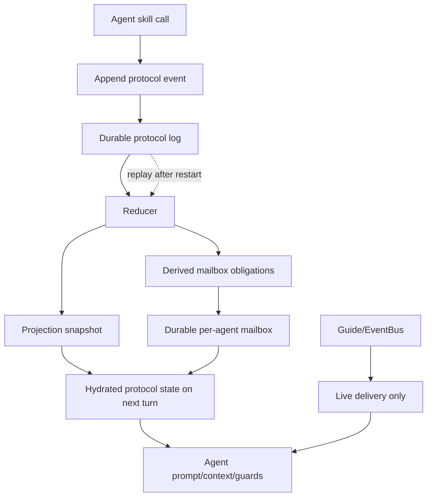
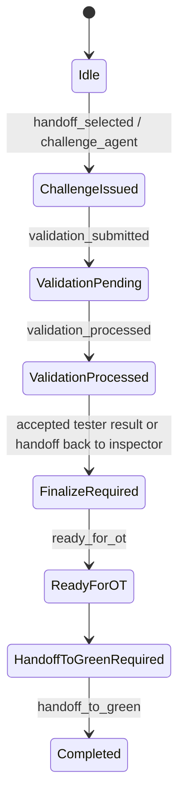
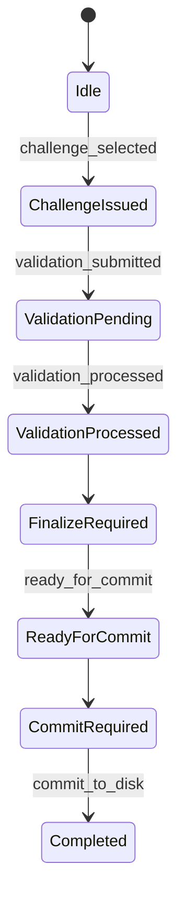
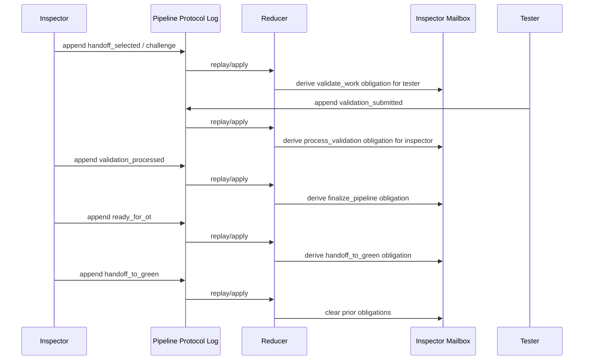
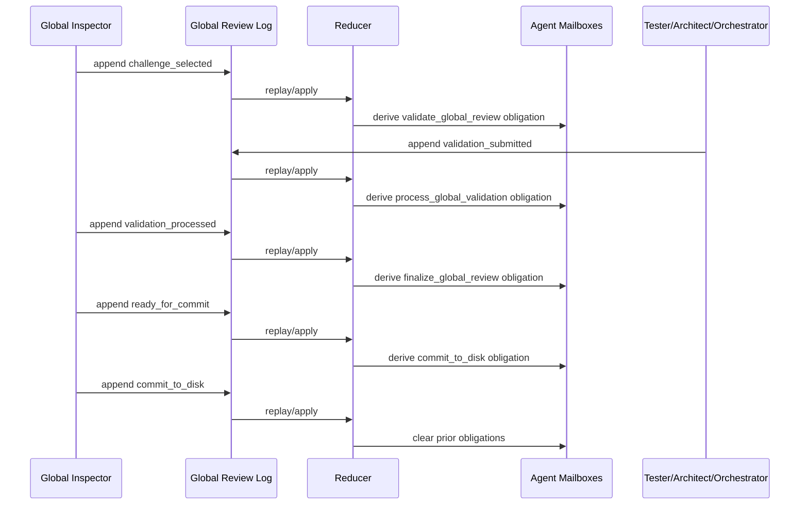

# Durable Protocol Logs And Agent Mailboxes

## Purpose

Sylk has two different coordination problems:

- live steering of an already-running request
- deterministic workflow progression across turns, context windows, agent handoffs, restarts, and crashes

The existing steering mailbox and steering WAL are correct for the first
problem. They are not sufficient for the second. Pipeline validation, global
review validation, finalization, and terminal handoff/commit steps must survive
turn boundaries and must not depend on prompt nudges or transient in-memory
state.

This document defines the durable event-log + reducer architecture now used for
workflow protocols such as:

- pipeline protocol
- global review protocol

## Design Goals

- durable workflow truth
- deterministic recovery and replay
- idempotent state reconstruction
- transport-independent protocol correctness
- agentic execution without brittle prompt injection
- reuse existing Sylk WAL/journal infrastructure before adding new storage
- keep live steering separate from workflow state

## What Is Reused

The implementation intentionally extends existing Sylk primitives instead of
introducing a second orchestration stack.

- `core/agentlog`
  Existing append-only journal format, sequencing, CRC protection, rotation,
  replay, and JSON event append helpers.
- `core/steering`
  Existing agent-local WAL + mailbox model. The durable mailbox design mirrors
  this shape, but is used for protocol obligations instead of human steering.
- existing protocol state machines in:
  - `agents/shared/pipeline_protocol.go`
  - `agents/shared/global_review_protocol.go`
- existing route/event transport:
  - `agents/guide`
  - stream metadata / inter-agent branch metadata

## Core Split

There are now two durable lanes:

1. agent-local mailbox logs
2. protocol-scoped event logs

They solve different problems.

### Agent Mailbox Log

Use this for:

- agent-local durable inbox/outbox semantics
- replayable protocol obligations
- recovery of “what this agent still owes the workflow”

Do not use this as the authoritative cross-agent workflow truth.

### Protocol Event Log

Use this for:

- facts about a shared workflow
- challenge issuance
- validation submission
- validation processing
- readiness transitions
- terminal handoff / commit decisions

This is the source of truth for cross-agent protocol state.

## Storage Layout

Authoritative storage is append-only journal data under the session tree.

```text
.sylk/sessions/<session_id>/
  agents/
    <agent_id>/
      wal/                      # existing steering/runtime WAL family
      mailbox/
        mailbox-*.wal           # durable obligation inbox/outbox log

  protocols/
    pipeline/
      <task_id>/
        wal/
          events-*.wal          # authoritative protocol event stream
        projection.snapshot.json

    global_review/
      <review_id>/
        wal/
          events-*.wal          # authoritative protocol event stream
        projection.snapshot.json
```

This split is intentional:

- per-agent folders own local mailbox state
- task/review folders own shared workflow truth

## Why WAL + Snapshots Instead Of SQLite

The current codebase already had a journal/WAL substrate in `core/agentlog`.
The robust extension was to reuse it rather than introduce a brand-new
transaction/query engine.

Authoritative storage:

- append-only binary WAL segments via `core/agentlog`

Derived acceleration:

- JSON projection snapshots written atomically beside the protocol log

This gives:

- cheap append
- simple replay
- crash tolerance
- deterministic sequence numbers
- low write amplification
- no new database lifecycle to manage

SQLite may still be useful later for secondary indexing or analytics, but it is
not the authoritative workflow store.

## Architecture



### Ordering Rule

The durable write happens before transport-level notification matters.

```text
append durable event
reduce event
persist snapshot
sync derived mailbox
publish / continue live flow
```

The bus is for timely delivery. The journal is for truth.

## Event Model

### Pipeline Protocol Events

Current durable event kinds:

- `handoff_selected`
- `validation_submitted`
- `validation_processed`
- `ready_for_ot`
- `handoff_to_green`

### Global Review Events

Current durable event kinds:

- `challenge_selected`
- `validation_submitted`
- `validation_processed`
- `ready_for_commit`
- `commit_to_disk`

## Reducer Model

The reducer consumes the protocol log and reconstructs:

- current snapshot
- processed validation history
- required terminal action
- required terminal-action reason
- derived mailbox obligations

Authoritative facts are stored as events.
Derived state is rebuilt by replay.

### Pipeline Reducer



### Global Review Reducer



## Mailbox Model

Mailbox items are not independent workflow facts. They are derived obligations
materialized for agent-local recovery and deterministic consumption.

Current item shape:

- stable `key`
- protocol `namespace`
- protocol `scope_id`
- target `agent_id`
- `item_kind`
- action
- summary
- payload

Mailbox sync is convergent:

- enqueue items that are now required
- acknowledge items that are no longer required
- reconstruct pending items by replaying the mailbox log

This gives each agent a durable, replayable inbox of “what the reducer says you
still owe.”

## Sequence Flow: Pipeline Validation



## Sequence Flow: Global Review



## Agent Interaction Model

Agents do not interact with the durable substrate directly. They continue to use
their existing protocol skills:

- pipeline:
  - `challenge_agent`
  - `handoff_next`
  - `validate_work`
  - `process_validation`
  - `finalize_pipeline`
  - `handoff_to_green`
- global review:
  - `challenge_global_tester`
  - `challenge_architect`
  - `challenge_orchestrator`
  - `validate_global_review`
  - `process_global_validation`
  - `finalize_global_review`
  - `commit_to_disk`

The difference is that those skills now append durable facts, and the reducer
derives the next obligations deterministically.

### Prompt / Context Surface

The reducer output is surfaced back to agents through existing context channels:

- pipeline task context now includes `pipeline_protocol_obligations`
- global review routed prompts now include reducer-derived protocol obligations
- required terminal actions are still enforced by protocol completion guards

This preserves agentic behavior while removing dependence on a single turn’s
ephemeral memory.

## Recovery Model

On restart or next turn:

1. open protocol log for the current `task_id` or `review_id`
2. load projection snapshot if present
3. replay post-snapshot events
4. rebuild current required action + pending validation/challenge state
5. resync durable mailboxes
6. hydrate task/metadata context for the active agent

No prompt surgery is required to “remember” the workflow.

## Invariants

The system should always maintain these invariants:

- the protocol log is authoritative
- snapshots are derived and disposable
- mailbox items are derived and disposable
- reducers are replay-safe
- handlers are idempotent over duplicated events
- required terminal actions survive across turns
- pending validations/challenges survive across turns
- transport loss does not erase workflow truth

## Performance Notes

The design is intentionally lightweight:

- append-only journal writes
- replay from snapshot sequence instead of full history every time
- mailbox sync only touches changed obligations
- no cross-agent database coordinator
- no dependence on heavyweight external brokers

The result is Kafka-like semantics where they matter:

- durable ordered append
- replayable reduction
- deterministic state reconstruction

without adding Kafka itself.

## Current Code

Primary implementation files:

- `core/agentlog/event_types.go`
- `core/agentlog/payload.go`
- `core/agentlog/journal.go`
- `agents/shared/durable_protocol_log.go`
- `agents/shared/durable_agent_mailbox.go`
- `agents/shared/pipeline_protocol.go`
- `agents/shared/pipeline_protocol_durable.go`
- `agents/shared/global_review_protocol.go`
- `agents/shared/global_review_protocol_durable.go`

Primary verification:

- `agents/shared/protocol_durable_test.go`
- `agents/shared/pipeline_protocol_test.go`
- `agents/shared/global_review_protocol_test.go`
- affected agent-package tests for pipeline/global inspector, tester, architect,
  engineer, and designer
