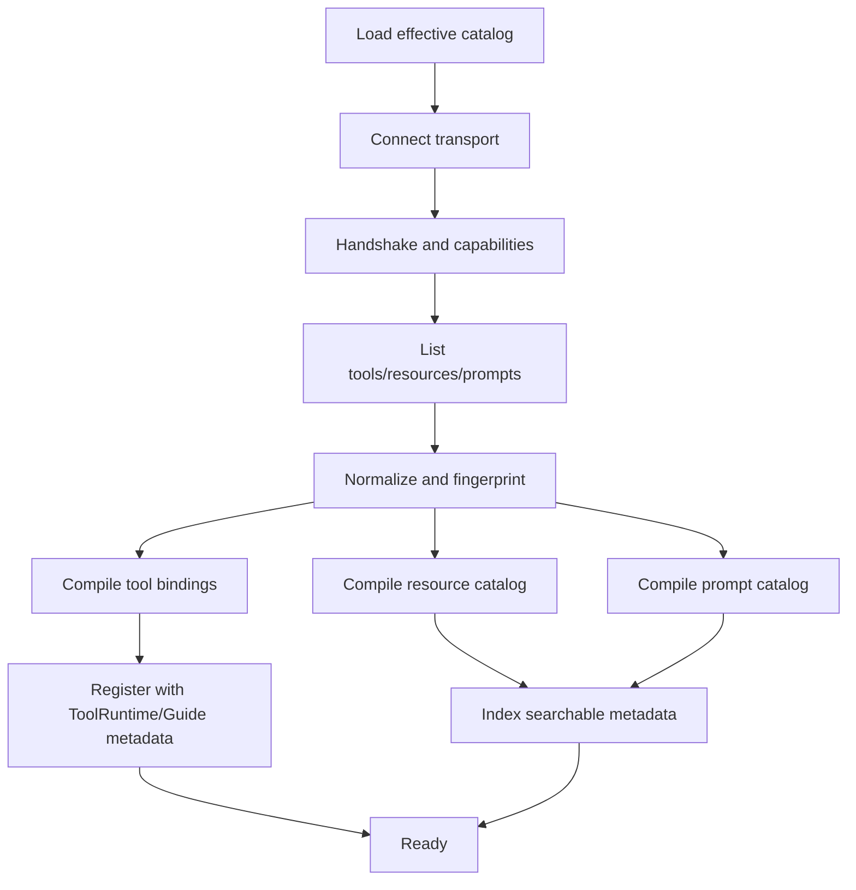
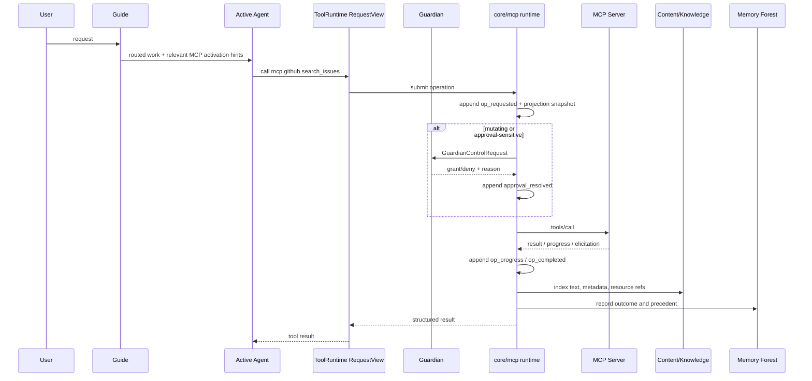
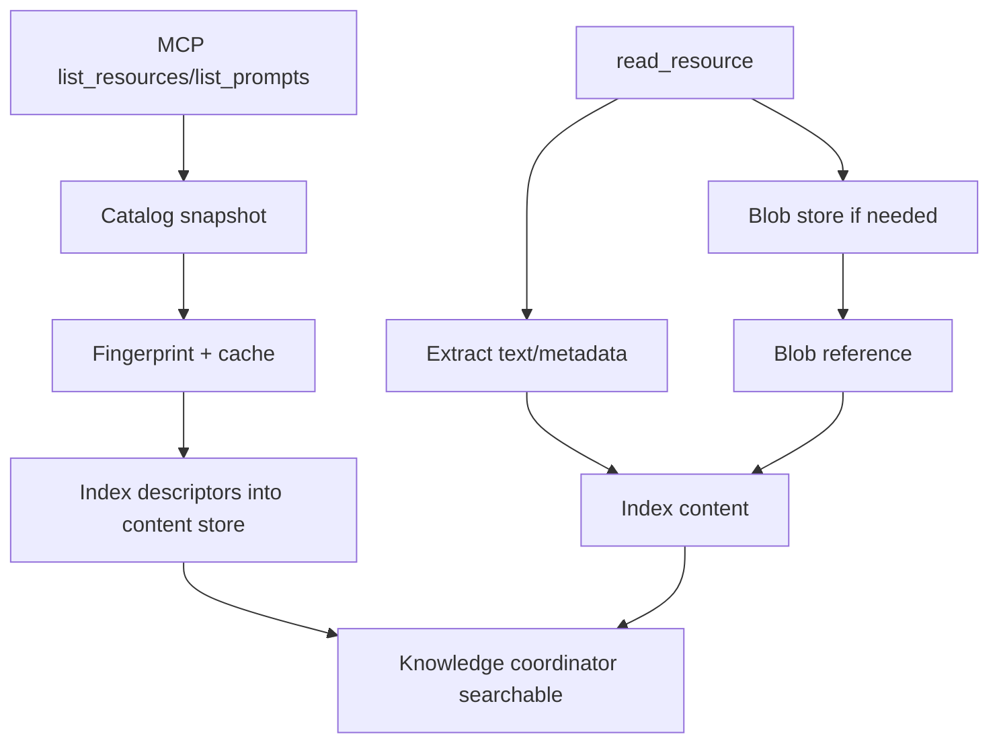
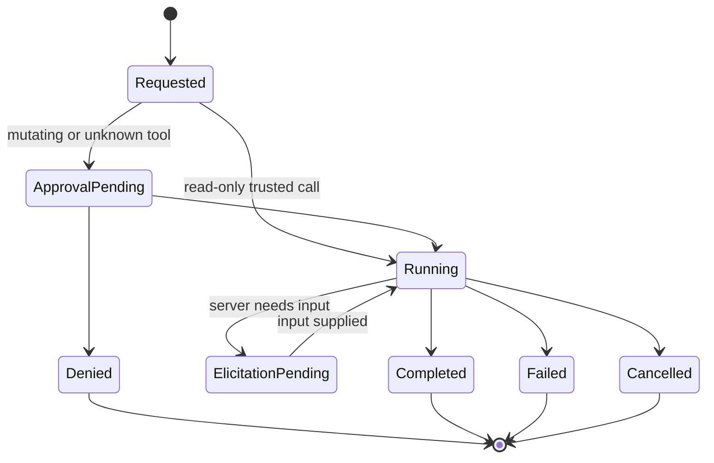
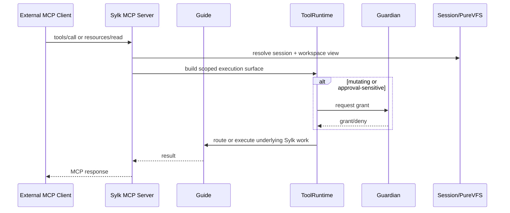

# Sylk MCP Architecture

## Overview

Sylk should implement MCP as a first-class external capability plane, not as a thin tool shim.

The design target is:

- external MCP servers become governed, searchable, durable Sylk capabilities
- MCP tools compile into Sylk `toolruntime` policy manifests and request-scoped activations
- MCP resources and prompts become queryable knowledge inputs, not prompt spam
- Guardian remains the single approval and trust plane
- long-running or approval-blocked MCP work survives restart through session-scoped durable logs
- Sylk itself can be exposed as an MCP server using the same Guide, ToolRuntime, Guardian, session, workspace, and knowledge substrate it already uses internally

This document defines the architecture, flows, state model, storage layout, diagrams, examples, and acceptance criteria for that system.

---

## Why This Exists

Claude Code's `mcp serve` is useful, but it is only one narrow slice of the overall problem: expose some tools over MCP and call them. Sylk should do more than that.

The problem Sylk needs to solve is:

- how to attach external capability systems without bypassing the Guide
- how to make remote tools obey Sylk's policy and Guardian trust model
- how to persist MCP work as durable session truth rather than transient transport state
- how to fold MCP resources and prompts into Sylk's knowledge, context, and memory systems
- how to let every agent use MCP in a way that is scoped, inspectable, and recoverable

The correct target is not "add an MCP command." The correct target is "make MCP part of Sylk's runtime fabric."

---

## Design Goals

1. `Control-plane native`
   All MCP capability registration, execution, approvals, and diagnostics integrate with Guide, Guardian, ToolRuntime, session state, and the existing knowledge stack.

2. `Request-scoped capability activation`
   MCP tools do not flood every prompt. Relevant tools are activated into a `toolruntime.RequestView` or `ScopedView` only when needed.

3. `Guardian-governed mutation`
   Remote mutation is not special-cased around Guardian. It uses the same grant, approval, and trust infrastructure as local dangerous operations.

4. `Durable truth before live delivery`
   MCP operations append durable session events before transport-level status updates matter.

5. `Knowledge-first resource handling`
   MCP resources and prompts become searchable, attributable content, with large blobs stored out-of-band.

6. `Agentic use, not just API plumbing`
   Guide, Architect, Guardian, Librarian, and other agents should be able to reason over available MCP capabilities, health, precedent, and outcomes.

7. `Session and workspace isolation`
   MCP execution must respect session boundaries, workspace views, and PureVFS snapshots where appropriate.

8. `Bidirectional MCP support`
   Sylk should both consume MCP servers and expose Sylk-native tools, resources, and prompts as an MCP server.

---

## Non-Goals

- injecting every remote tool and prompt into every model turn
- creating a second approval system outside Guardian
- storing raw blobs or credentials in prompt context
- treating MCP transport state as the source of truth
- making MCP a direct bypass around ToolRuntime policy or session/workspace controls

---

## Reused Sylk Primitives

This design intentionally extends existing Sylk seams instead of introducing a separate subsystem stack.

- `agents/guide`
  Routing, observability, metadata propagation, correlation IDs, health-aware capability visibility.
- `core/toolruntime`
  Capability scoping, request-scoped activation, execution policy manifests, Guardian-controlled execution.
- `agents/guardian`
  Approval, trust, summaries, diagnostics, persisted project-local rules.
- `agents/shared/durable_agent_mailbox.go`
  Durable pending obligations and resumable local work.
- `core/agentlog`
  Authoritative append-only session journals.
- `core/session`
  Multi-session lifecycle and session identity.
- `core/purevfs`
  Workspace/snapshot/branch isolation where MCP execution needs a scoped view of files.
- `core/context` and `core/knowledge`
  Universal content indexing and hybrid text/semantic/graph query.
- `core/context/skills/forest_skills.go`
  Memory Forest recall, prediction, and outcome recording.
- `agents/shared/self_diagnostic.go`
  Uniform diagnostic surfacing for MCP connectors and the Sylk MCP server.

---

## System Topology

```text
┌───────────────────────────── SYLK CONTROL PLANE ─────────────────────────────┐
│                                                                              │
│  ┌────────────────────────────────────────────────────────────────────────┐  │
│  │ Guide                                                                 │  │
│  │ - capability visibility                                               │  │
│  │ - request classification                                               │  │
│  │ - routing hints for MCP-backed work                                    │  │
│  │ - correlation, metadata, observability                                 │  │
│  └──────────────────────────────┬─────────────────────────────────────────┘  │
│                                 │                                            │
│  ┌──────────────────────────────▼─────────────────────────────────────────┐  │
│  │ ToolRuntime                                                           │  │
│  │ - compiled MCP tool bindings                                          │  │
│  │ - request/scoped activation                                            │  │
│  │ - manifest fingerprinting                                              │  │
│  │ - Guardian-controlled mutation                                         │  │
│  └───────────────┬───────────────────────────────┬────────────────────────┘  │
│                  │                               │                           │
│  ┌───────────────▼──────────────┐  ┌─────────────▼───────────────────────┐  │
│  │ Guardian                     │  │ core/mcp fabric                     │  │
│  │ - grants                     │  │ - server catalog                    │  │
│  │ - trust rules                │  │ - transports                        │  │
│  │ - elicitation                │  │ - capability snapshots              │  │
│  │ - summaries/diagnostics      │  │ - operation log + reducers          │  │
│  └───────────────┬──────────────┘  │ - resource/prompt cache             │  │
│                  │                 │ - reconnect + invalidation          │  │
│                  │                 └─────────────┬───────────────────────┘  │
│                  │                               │                           │
│  ┌───────────────▼───────────────────────────────▼───────────────────────┐  │
│  │ Session + Workspace + Knowledge + Forest                              │  │
│  │ - session-scoped WAL truth                                             │  │
│  │ - PureVFS view selection                                               │  │
│  │ - content ingestion                                                    │  │
│  │ - hybrid retrieval                                                     │  │
│  │ - precedent/outcome learning                                           │  │
│  └──────────────────────────────┬─────────────────────────────────────────┘  │
└─────────────────────────────────┼─────────────────────────────────────────────┘
                                  │
                    ┌─────────────┴────────────────────────────────┐
                    │                                              │
      ┌─────────────▼─────────────┐               ┌────────────────▼──────────────┐
      │ External MCP Servers       │               │ Sylk MCP Server Mode          │
      │ - stdio                    │               │ - Sylk tools                  │
      │ - SSE / HTTP / WS          │               │ - session resources           │
      │ - prompts/resources/tools  │               │ - prompts/workflows           │
      │ - notifications            │               │ - approvals/elicitation       │
      └────────────────────────────┘               └───────────────────────────────┘
```

---

## Core Architectural Principle

### MCP Is A Capability Plane, Not A Tool Dump

External MCP servers should project into Sylk in four forms:

1. `Compiled tool bindings`
   Remote tools become local wrapper skills governed by `core/toolruntime`.

2. `Capability metadata`
   Guide and Architect can reason over connected servers, declared domains, health, and capability summaries.

3. `Knowledge assets`
   Resources, prompt templates, and server instructions become searchable indexed content.

4. `Durable operation streams`
   Every meaningful MCP action has a session-scoped durable record.

This is what makes MCP feel native inside Sylk rather than bolted on.

---

## Proposed Package Layout

```text
core/mcp/
  types.go                   # shared structs and enums
  catalog/
    store.go                 # global + project-local server definitions
    merge.go                 # overlay resolution and precedence
  transport/
    stdio.go
    sse.go
    http.go
    ws.go
    reconnect.go
  client/
    session.go               # per-server connection/session wrapper
    capabilities.go          # tools/resources/prompts/instructions sync
    notifications.go         # list_changed and server-driven events
  compiler/
    tools.go                 # MCP tool -> Sylk wrapper skill + ToolPolicy
    resources.go             # resource descriptors -> indexed catalogs
    prompts.go               # prompt descriptors -> retrievable assets
    naming.go                # canonical names + provider aliases
  runtime/
    execute.go               # operation submission + streaming + reduction
    approvals.go             # Guardian request/grant wiring
    elicitation.go           # structured missing-input handling
    cache.go                 # hot caches and content-addressed blob refs
    diagnostics.go           # health, latency, error, capability status
  durable/
    oplog.go                 # append-only operation journal
    reducer.go               # snapshot and mailbox derivation
    projection.go
  ingest/
    resources.go             # text extraction + content store writes
    prompts.go               # prompt metadata + instruction indexing
    results.go               # tool result indexing and blob handling
  server/
    stdio.go                 # Sylk-as-MCP-server entrypoint
    tools.go                 # exported Sylk tools
    resources.go             # exported Sylk resources
    prompts.go               # exported Sylk prompts
    sessions.go              # session/workspace resolution
```

This does not replace existing Sylk subsystems. It binds MCP into them.

---

## Canonical Skill And Tool Shape

Sylk already has a concrete skill and tool model in Go. MCP import/export should match that model rather than inventing a second schema language.

The authoritative internal capability shape is `core/skills.Skill`:

```go
type Skill struct {
    Name        string
    Description string
    InputSchema *InputSchema
    Handler      Handler          // runtime-only, never serialized
    ProviderTool *ProviderTool

    Loaded   bool                 // runtime-only
    Priority int
    Domain   string
    Keywords []string
    InvokeCount int64             // runtime-only
    EstimatedTokens int

    UsageDoc      string
    BestPractices []string
    Examples      []string
    Requirements  []string
    Satisfies     []string
    Avoids        []string
}

type InputSchema struct {
    Type       string
    Properties map[string]*Property
    Required   []string
}

type Property struct {
    Type        string
    Description string
    Enum        []string
    Items       *Property
    Properties  map[string]*Property
    Required    []string
    Default     any
}
```

The provider/tool-call surface derived from a skill is `core/providers.Tool`:

```go
type Tool struct {
    Kind        ToolKind
    Name        string
    Description string
    Parameters  map[string]any
    WebSearch   *WebSearchOptions
}
```

That conversion already exists in `core/toolruntime/runtime.go`:

- normal function tools use the skill's `InputSchema` marshaled to JSON schema
- descriptions are compiled from the skill's docs plus policy metadata
- provider-native tools use `Skill.ProviderTool` when present

### Consequence

The canonical MCP import/export contract should be:

1. `Skill-shaped data` is the rich, lossless representation.
2. `providers.Tool` is the flattened execution/export representation.
3. MCP-imported tools are normalized into a `skills.Skill`-compatible spec first.
4. ToolRuntime then derives provider tools from that normalized skill spec.

The system should never treat an arbitrary raw MCP JSON schema blob as the final Sylk-native representation.

---

## Skill Builder Correspondence

Today Sylk authors most capabilities through the fluent builder API:

```go
skills.NewSkill("read_file").
    Description("Read file contents for planning context gathering.").
    Domain("filesystem").
    Keywords("read", "file", "content", "cat", "view").
    Priority(95).
    StringParam("path", "Path to file", true).
    IntParam("offset", "Starting line offset (0-based)", false).
    IntParam("limit", "Max lines to return", false).
    Usage("Use when the Architect needs to examine file contents for planning context.").
    Example(`{"path":"core/auth/handler.go","offset":0,"limit":200}`).
    BestPractice("Start with limit=200 for initial file exploration.").
    Handler(...)
```

The MCP system should preserve that same semantic structure:

- identity: `Name`
- operator docs: `Description`, `UsageDoc`, `BestPractices`, `Examples`, `Requirements`, `Satisfies`, `Avoids`
- retrieval/load hints: `Domain`, `Keywords`, `Priority`, `EstimatedTokens`
- schema: `InputSchema` and recursive `Property`
- provider-native specialization: `ProviderTool`

What should not be imported from remote data as authoritative:

- `Handler`
- `Loaded`
- `InvokeCount`

Those are runtime state, not manifest state.

---

## Naming Model

Canonical internal names should be stable and attributable:

- tool: `mcp.<server_id>.<tool_name>`
- resource: `mcp://<server_id>/<uri>`
- prompt: `mcp.prompt.<server_id>.<prompt_name>`

Provider-specific exported aliases may be synthesized when required:

- Anthropic/tool-export alias: `mcp_<server_id>_<tool_name>`

Canonical identity is always the internal form. Provider aliases are transport adapters only.

---

## Canonical MCP Manifest Shapes

### Rich Skill Manifest

When Sylk persists, imports, or exchanges MCP-backed capabilities in a Sylk-native format, it should use a manifest isomorphic to `skills.Skill` plus execution binding and policy metadata.

```go
type MCPCompiledSkillSpec struct {
    Skill   MCPSkillSpec          `json:"skill"`
    Binding MCPBindingSpec        `json:"binding"`
    Policy  toolruntime.ToolPolicy `json:"policy"`
}

type MCPSkillSpec struct {
    Name            string                  `json:"name"`
    Description     string                  `json:"description"`
    InputSchema     *skills.InputSchema     `json:"input_schema,omitempty"`
    ProviderTool    *skills.ProviderTool    `json:"provider_tool,omitempty"`
    Priority        int                     `json:"priority,omitempty"`
    Domain          string                  `json:"domain,omitempty"`
    Keywords        []string                `json:"keywords,omitempty"`
    EstimatedTokens int                     `json:"estimated_tokens,omitempty"`
    UsageDoc        string                  `json:"usage_doc,omitempty"`
    BestPractices   []string                `json:"best_practices,omitempty"`
    Examples        []string                `json:"examples,omitempty"`
    Requirements    []string                `json:"requirements,omitempty"`
    Satisfies       []string                `json:"satisfies,omitempty"`
    Avoids          []string                `json:"avoids,omitempty"`
}

type MCPBindingSpec struct {
    ServerID        string `json:"server_id"`
    CapabilityKind  string `json:"capability_kind"` // tool, resource, prompt
    RemoteName      string `json:"remote_name,omitempty"`
    RemoteURI       string `json:"remote_uri,omitempty"`
    PromptName      string `json:"prompt_name,omitempty"`
    Fingerprint     string `json:"fingerprint,omitempty"`
    InstructionsRef string `json:"instructions_ref,omitempty"`
}
```

This is the canonical internal interchange format because it preserves the same fields Sylk already uses for:

- prompt/tool documentation
- progressive loading and search
- nested object/array schemas
- provider-native specialization

### Flattened Tool Export

When Sylk needs to expose a capability to a model provider or over MCP as a callable tool, it should derive the flattened representation from the compiled skill:

```json
{
  "name": "mcp.github.search_issues",
  "description": "Search issues in GitHub. Effect: read_only. Domain: research. Execution: local. Use when: ...",
  "input_schema": {
    "type": "object",
    "properties": {
      "query": { "type": "string", "description": "Issue search query" },
      "repo":  { "type": "string", "description": "Optional repository filter" },
      "limit": { "type": "integer", "description": "Maximum matches" }
    },
    "required": ["query"]
  }
}
```

That shape should be produced from the `Skill` form, not hand-authored separately.

### Tool-Only Ingest

If Sylk ingests a plain MCP tool definition with no rich skill metadata, it should immediately normalize it into a `MCPSkillSpec`:

- `name` -> `Skill.Name`
- `description` -> `Skill.Description`
- JSON schema -> `Skill.InputSchema`
- inferred docs -> `UsageDoc` and `Examples` remain empty unless supplied elsewhere
- inferred domain/keywords -> derived from server metadata, tool name, and schema terms

This keeps the internal representation consistent even when the remote source is less expressive than Sylk.

---

## Server Catalog And Scoping

Sylk should support layered MCP server configuration:

1. `user-global`
   Shared machine-level server definitions and credentials references.

2. `project-local`
   Workspace-attached servers, personal overrides, project trust, local tool allow/deny lists.

3. `session-scoped overlays`
   Temporary enablement, routing bias, or prompt/resource pinning for the active session.

### Proposed Storage Layout

```text
~/.sylk/
  mcp/
    servers.yaml             # global catalog
    credentials.yaml         # refs only; no raw secrets in session logs
    cache/
      catalogs/
        <server_id>.json

.sylk/local/
  mcp_servers.yaml           # project-local server overlay
  mcp_trust.yaml             # project-local allow/deny overrides
  mcp_prefs.yaml             # server ordering, routing hints, pins

.sylk/sessions/<session_id>/
  mcp/
    ops/
      <op_id>/
        wal/
          events-*.wal
        projection.snapshot.json
    servers/
      <server_id>/
        capability.snapshot.json
        resources.snapshot.json
        prompts.snapshot.json
        mailbox/
          mailbox-*.wal
    blobs/
      <sha256>
```

### Configuration Precedence

```text
global catalog
    ↓
project-local overlay
    ↓
session-scoped overrides
    ↓
effective server view
```

Server config includes at minimum:

- server identity
- transport type and endpoint
- workspace affinity
- declared domains
- default effect assumptions
- allow/deny rules
- credential reference
- routing hints
- indexing preferences

---

## Capability Discovery And Compilation

When a server connects, Sylk should not directly dump its raw capabilities into all prompts. Instead it should compile the server into stable Sylk artifacts.

### Capability Sync Flow



### Tool Compilation Rules

Each MCP tool compiles into:

- a wrapper skill handler that delegates to `core/mcp/runtime`
- a normalized `MCPSkillSpec` matching Sylk's existing `skills.Skill` shape
- a `toolruntime.ToolPolicy`
- a stable fingerprint over:
  - server identity
  - remote tool name
  - schema
  - effect metadata
  - domain mapping
  - trust-relevant config

Default execution mapping:

- remote read-only tool -> `ExecutionModeLocal`
- remote mutating tool -> `ExecutionModeGuardian`
- remote async/worker-oriented tool -> `ExecutionModeLocalWorker` or `ExecutionModeGuardian` depending on effect

Default effect mapping:

- declared safe/read-only -> `EffectReadOnly`
- declared mutating or side-effecting -> `EffectMutating`
- unknown -> `EffectMutating` unless a trusted server-specific override says otherwise

Default domain mapping is inferred from:

- server config
- MCP annotations
- tool name
- prompt keywords
- resource families

If domain inference is ambiguous, Sylk should choose the narrowest safe domain or fall back to `system` with Guardian scrutiny.

### Compilation Pipeline

The compilation pipeline should be explicit:

```text
raw MCP tool/resource/prompt descriptor
    ↓
normalize into Skill-shaped manifest
    ↓
attach MCP binding metadata
    ↓
attach ToolPolicy
    ↓
register wrapper handler in ToolRuntime
    ↓
derive providers.Tool / MCP export form on demand
```

This keeps import, activation, provider export, search, and diagnostics all centered on the same capability object model.

---

## Request Activation Model

Connected MCP tools should enter model context only through request-scoped activation.

### Activation Path

1. Guide classifies the request and identifies likely MCP domains or servers.
2. Architect or the active agent chooses relevant capabilities.
3. ToolRuntime creates a `RequestView` or `ScopedView` containing only those MCP bindings plus needed local tools.
4. The agent executes within that smaller surface.

This preserves:

- prompt discipline
- better tool selection
- less tool bloat
- clearer approval semantics
- lower hot-path latency

MCP is therefore additive to Sylk's existing active-tool model instead of bypassing it.

---

## End-To-End Tool Call Flow



### Ordering Rule

The durable write happens before the live update matters.

```text
append durable event
reduce projection
sync derived mailbox state
publish live progress / continue turn
```

The transport is for timeliness. The journal is for truth.

---

## Guardian Integration

Guardian remains the sole approval and trust plane for remote mutation.

### Guardian Responsibilities For MCP

- approve or deny project-local server attachment when required
- approve or deny tool execution for mutating or unknown-effect remote tools
- persist allow/deny/trust decisions with server/tool/argument-fingerprint precision
- explain why a call was auto-approved or blocked
- summarize trust posture for a server
- surface MCP risk in existing Guardian diagnostics

### Grant Validation

MCP grants should validate the same fields Sylk already uses for dangerous local execution:

- `AgentID`
- `CorrelationID`
- `CapabilityScope`
- `ToolName`
- `ArgumentsHash`
- `PolicyFingerprint`
- `ExpiresAt`

If any of those do not match, the MCP call is rejected before hitting the remote server.

### Trust Granularity

Trust can be recorded at several levels:

- server attach
- server transport endpoint
- tool name
- tool name + argument fingerprint
- read-only resource families
- prompt invocation families

There is still one trust authority: Guardian.

---

## Structured Elicitation

MCP servers may request missing inputs or approvals mid-call.

Sylk should map that into a durable elicitation protocol rather than a transient callback.

### Elicitation Flow

1. MCP runtime appends `elicitation_requested`.
2. Derived mailbox obligation is created for the target agent or Guardian.
3. UI/agent surfaces the missing information.
4. User or Guardian resolves it.
5. Runtime appends `elicitation_resolved`.
6. Remote call continues or is terminated deterministically.

This makes mid-call interaction restart-safe.

---

## Resource And Prompt Handling

### Resources

Resources are knowledge assets first and transport payloads second.

Rules:

- resource descriptors are cataloged immediately
- `resources/list_changed` invalidates the affected catalog snapshot
- `read_resource` stores binary or large payloads out-of-band under content-addressed blob refs
- extracted text and metadata are indexed into the Universal Content Store
- resource provenance remains attached to the indexed content

### Prompts

Prompts are not injected globally into every model turn.

Instead, Sylk should:

- catalog prompt names, descriptions, input schema, and server instructions
- index prompt metadata into knowledge
- expose prompts as retrievable assets or explicitly invocable workflows
- allow Architect or Guide to suggest prompt usage when relevant

This keeps MCP prompts useful without turning them into context pollution.

### Prompt Shape

Sylk prompt manifests should also mirror the current skill-documentation model instead of using an unrelated prompt-only format.

An MCP prompt imported into Sylk should therefore normalize into a skill-like document envelope:

- `name`
- `description`
- `domain`
- `keywords`
- `usage_doc`
- `best_practices`
- `examples`
- input schema if the prompt is parameterized
- binding metadata pointing to the MCP prompt name/server

The difference between a prompt-backed capability and a tool-backed capability is binding and execution mode, not documentation shape.

### Resource/Prompt Ingestion Flow



---

## Durable State Model

MCP work needs authoritative session truth. The transport connection is not that truth.

### Storage Layout

```text
.sylk/sessions/<session_id>/
  mcp/
    ops/
      <op_id>/
        wal/
          events-*.wal
        projection.snapshot.json

    servers/
      <server_id>/
        capability.snapshot.json
        resources.snapshot.json
        prompts.snapshot.json
        mailbox/
          mailbox-*.wal
```

### Operation Record

```go
type MCPOperation struct {
    OperationID        string
    SessionID          string
    CorrelationID      string
    AgentID            string
    ServerID           string
    CapabilityScope    string
    Kind               string // tool_call, resource_read, prompt_invoke
    LocalName          string
    RemoteName         string
    ArgumentsHash      string
    PolicyFingerprint  string
    Status             string
    BlobRefs           []string
    ResultSummary      string
    Error              string
    StartedAt          time.Time
    UpdatedAt          time.Time
    CompletedAt        *time.Time
}
```

### Event Kinds

Authoritative durable event kinds should include:

- `server_registered`
- `transport_connected`
- `transport_disconnected`
- `capabilities_synced`
- `catalog_invalidated`
- `op_requested`
- `approval_requested`
- `approval_resolved`
- `elicitation_requested`
- `elicitation_resolved`
- `op_progress`
- `blob_stored`
- `content_indexed`
- `op_completed`
- `op_failed`
- `op_cancelled`

### Operation State Machine



### Mailbox Use

Mailbox items are derived obligations, not authoritative truth.

Use mailbox derivation for:

- pending elicitation
- retryable failed operations
- reconnect-required connector work
- Guardian review obligations

This mirrors Sylk's existing durable protocol split:

- journal = truth
- projection = current state
- mailbox = pending obligation

---

## Capability Metadata For Guide And Architect

Guide should not directly execute MCP transport, but it should understand connected MCP capability shape.

Each connected server should publish:

- server identity
- declared domains
- tool inventory summary
- prompt inventory summary
- resource inventory summary
- health
- latency/error counters
- trust posture
- last capability fingerprint

Guide can use that metadata to:

- bias routing toward connected capability planes
- suggest MCP-backed workflows
- explain why an MCP tool was considered relevant
- suppress unhealthy or disconnected servers from activation suggestions

Architect can use the same metadata to:

- plan workflows that depend on external systems
- validate that required capabilities exist before DAG construction
- recover from server disconnection or degraded state

---

## Knowledge And Memory Forest Integration

MCP should strengthen Sylk's long-horizon reasoning, not only expand tool count.

### Knowledge Ingestion

Index the following into the Universal Content Store:

- resource descriptors
- extracted resource text
- prompt metadata
- server instructions
- important tool results
- diagnostic summaries

Each indexed item should carry:

- server ID
- operation ID
- session ID
- content type
- provenance URI
- trust level
- timestamp

The hybrid knowledge coordinator can then retrieve MCP-derived knowledge alongside repo, session, and historical content.

### Memory Forest Learning

Record outcome and reliability signals such as:

- tool succeeded
- tool failed due to auth
- tool failed due to schema mismatch
- tool repeatedly required approval
- server frequently times out
- a given prompt template led to good or bad outcomes

This lets the Forest learn:

- which servers are reliable for which intents
- which tools are low-risk/high-value
- which prompt templates are useful in specific contexts
- which integrations should be deprioritized or challenged

MCP is therefore not just "available now." It becomes "understood over time."

---

## PureVFS And Session Isolation

Some MCP interactions should operate over the active workspace view rather than raw disk.

Examples:

- server asks for file content referenced by session edits
- external review tool should see the session's VFS state
- Sylk-as-server exports session-scoped resources over the active workspace

Rules:

- workspace-aware MCP calls receive a resolved workspace view, not implicit disk access
- session-specific operations carry `SessionID` and `CapabilityScope`
- any file material exported to an MCP server should be traceable to a workspace view or snapshot
- remote tools never gain implicit file authority beyond the call contract

This keeps MCP aligned with Sylk's session model instead of flattening back to raw filesystem semantics.

---

## Diagnostics

Every MCP connector and the Sylk MCP server should expose `self_diagnostic`.

Diagnostic output should include:

- connection state
- last successful handshake time
- last capability sync fingerprint
- transport latency and error rates
- recent failures
- active operations
- pending mailbox obligations
- approval backlog
- cache health
- indexing backlog

MCP should therefore inherit Sylk's existing "ask the agent what is wrong" behavior rather than forcing users into opaque logs.

---

## Sylk As An MCP Server

Sylk server mode should expose Sylk-native capabilities, not merely forward a random subset of internal skills.

### Export Classes

1. `Tools`
   Structured actions backed by Guide, ToolRuntime, Guardian, git mode, search, diagnostics, and knowledge retrieval.

2. `Resources`
   Session summaries, pipeline status, git state, diagnostics, knowledge documents, memory packets, selected workspace views.

3. `Prompts`
   Opinionated workflows such as:
   - review current branch
   - continue last task
   - explain failing test
   - summarize active conflicts
   - inspect Guardian trust posture

### Export Rules For Sylk Skills

When exporting Sylk-native skills through the Sylk MCP server:

- the exported name comes from `Skill.Name` after MCP namespacing
- the exported input schema comes from `Skill.InputSchema`
- the exported description is produced from the same compiled description path ToolRuntime already uses
- nested object and array schemas must be preserved exactly
- `UsageDoc`, `BestPractices`, `Requirements`, `Satisfies`, and `Avoids` should remain available as MCP annotations or companion resources even if the transport tool schema only exposes `name`, `description`, and `input_schema`

This avoids losing most of the guidance Sylk has already authored into its tools.

### Ingest Rules For Sylk Server Extensions

If the Sylk MCP server supports loading extension-defined tools or prompts, the ingest format should prefer the rich skill manifest above.

That means extension payloads should be allowed to declare:

- full `Skill` metadata
- recursive `InputSchema`
- optional `ProviderTool`
- MCP `Binding`
- `ToolPolicy`

Then Sylk should compile that into a live runtime wrapper skill the same way it compiles a discovered remote MCP tool.

The server may accept raw tool-only payloads as a compatibility format, but canonicalization to the rich skill manifest should happen immediately.

### Server Flow



### Server Rules

- external clients must not bypass Guardian
- exported resources are session/workspace scoped
- large content is served via resource references or chunked reads, not prompt stuffing
- every external call gets a correlation ID and durable event trail if it mutates or blocks
- server-side prompt surfaces are thin wrappers over real Sylk workflows

---

## Examples

### Example 1: Read-Only GitHub Search Tool

User asks:

```text
Find open GitHub issues related to flaky CI in this repo.
```

Flow:

1. Guide classifies this as a git/research/integration query.
2. Request-scoped activation includes:
   - local repo search tools
   - `mcp.github.search_issues`
3. Agent calls `mcp.github.search_issues`.
4. MCP runtime appends `op_requested`.
5. No Guardian grant is needed because the tool is read-only and trusted.
6. Result comes back, relevant text is indexed, and the operation is recorded as completed.
7. Forest records that GitHub issue search was useful for this intent family.

### Example 2: Mutating Pull Request Creation

Agent wants to call:

```json
{
  "tool": "mcp.github.create_pull_request",
  "args": {
    "base": "main",
    "head": "feature/mcp",
    "title": "Add MCP capability plane"
  }
}
```

Flow:

1. Wrapper skill maps to a mutating `ToolPolicy`.
2. MCP runtime appends `op_requested`.
3. Guardian receives a control request containing:
   - tool name
   - agent ID
   - correlation ID
   - argument hash
   - policy fingerprint
4. Guardian approves once or matches an existing trusted rule.
5. Runtime appends `approval_resolved`.
6. Remote call executes.
7. Result is recorded and surfaced back to the agent.

### Example 2A: Skill Manifest Correspondence

Go-side authored skill:

```go
skills.NewSkill("mcp.github.create_pull_request").
    Description("Create a pull request in GitHub.").
    Domain("git").
    Keywords("github", "pull request", "pr", "merge").
    Priority(85).
    StringParam("base", "Base branch", true).
    StringParam("head", "Head branch", true).
    StringParam("title", "Pull request title", true).
    StringParam("body", "Optional pull request body", false)
```

Corresponding canonical MCP-backed manifest:

```json
{
  "skill": {
    "name": "mcp.github.create_pull_request",
    "description": "Create a pull request in GitHub.",
    "domain": "git",
    "keywords": ["github", "pull request", "pr", "merge"],
    "priority": 85,
    "input_schema": {
      "type": "object",
      "properties": {
        "base":  {"type": "string", "description": "Base branch"},
        "head":  {"type": "string", "description": "Head branch"},
        "title": {"type": "string", "description": "Pull request title"},
        "body":  {"type": "string", "description": "Optional pull request body"}
      },
      "required": ["base", "head", "title"]
    }
  },
  "binding": {
    "server_id": "github",
    "capability_kind": "tool",
    "remote_name": "create_pull_request"
  },
  "policy": {
    "name": "mcp.github.create_pull_request",
    "capability_scope": "github",
    "effect": "mutating",
    "domain": "git",
    "execution": "guardian_controlled",
    "approval_sensitive": true
  }
}
```

This is the level of correspondence Sylk should preserve across Go code, persisted manifests, and MCP runtime state.

### Example 3: Resource Catalog Invalidation

The docs server emits `resources/list_changed`.

Flow:

1. Connector invalidates the cached resource catalog for that server.
2. It appends `catalog_invalidated`.
3. Background sync refreshes descriptors.
4. New descriptors are indexed into knowledge.
5. Guide capability metadata updates to reflect the new catalog fingerprint.

### Example 4: Sylk As MCP Server For External Review

External client asks Sylk to review the active branch.

Flow:

1. Sylk MCP server resolves the active session and workspace view.
2. It invokes a scoped Sylk workflow prompt.
3. Guide routes review work internally.
4. Results are returned as an MCP response, with resource links for deeper drill-down.

---

## Acceptance Criteria

### Functional

- Sylk can register MCP servers from global and project-local catalogs.
- Sylk can connect over supported transports and persist effective server state.
- Sylk can sync tools, resources, prompts, and server instructions into capability snapshots.
- MCP tools compile into request-activatable ToolRuntime bindings with stable fingerprints.
- Mutating or unknown-effect tools require Guardian approval unless a valid trust rule matches.
- Read-only tools can execute without approval when policy and trust allow it.
- `resources/list_changed` and similar notifications invalidate affected caches without requiring restart.
- `read_resource` stores large payloads out-of-band and indexes extracted text into knowledge.
- prompt metadata becomes searchable and explicitly invocable without global prompt injection.
- long-running or elicitation-blocked MCP calls survive restart and can resume from durable state.
- every MCP connector exposes `self_diagnostic`.
- Sylk can expose a real MCP server surface for tools, resources, and prompts.

### Correctness

- every operation has a durable event stream and projection snapshot
- every operation carries `SessionID`, `CorrelationID`, `AgentID`, and `CapabilityScope`
- every Guardian grant validates against tool name, args hash, policy fingerprint, and expiry
- raw credentials are never written into session logs or projections
- large blobs are referenced, not stuffed into prompt context
- disabled, unhealthy, or disconnected servers are not offered for request activation

### Performance

- warm servers do not re-fetch tools/resources/prompts on every request
- invalidation is incremental and does not stall unrelated calls
- request-scoped activation prevents tool explosion in model context
- resource and prompt catalogs are searchable without full transport round-trips
- MCP-ingested content becomes retrievable through the existing hybrid knowledge query path

### Agentic Behavior

- Guide can reason over available MCP capability metadata during routing
- Architect can plan around MCP availability and degradation
- Guardian can explain trust state and approval rationale for MCP actions
- Forest can learn from MCP outcomes and influence future tool/prompt selection

---

## Test Matrix

Minimum implementation test coverage should include:

- server catalog merge precedence
- transport reconnect and capability resync
- tool compilation and manifest fingerprint stability
- Guardian grant validation mismatch rejection
- read-only vs mutating execution policy enforcement
- durable resume after restart during:
  - approval pending
  - elicitation pending
  - transport disconnect
  - post-result pre-indexing
- resource blob storage and extracted-text indexing
- `list_changed` invalidation and refresh
- Sylk MCP server round-trip for tool, resource, and prompt surfaces

---

## Implementation Phases

### Phase 1: Consumption Core

- add server catalog, transports, capability sync, cache, and tool compilation
- support read-only tool calls and resource cataloging

### Phase 2: Governance And Durability

- add Guardian wiring, durable operation journals, mailbox derivation, and restart recovery

### Phase 3: Knowledge And Forest

- add resource/prompt/result ingestion into content store and forest outcome recording

### Phase 4: Sylk Server Mode

- expose Sylk-native tools/resources/prompts over MCP with session/workspace resolution

### Phase 5: Routing Intelligence

- feed capability metadata, health, and precedent back into Guide and Architect planning

---

## Bottom Line

The maximally Sylk-native MCP implementation is not "a server command that forwards tools." It is a governed, durable, knowledge-aware capability plane.

That means:

- ToolRuntime compiles and scopes MCP tools
- Guardian approves and explains trust
- Guide sees capability shape and health
- durable logs own operation truth
- knowledge ingestion makes resources and prompts searchable
- Memory Forest learns from outcomes
- session and PureVFS boundaries remain intact
- Sylk itself can be exported as an MCP server without bypassing any of the above

That is the version of MCP that actually compounds Sylk's architecture instead of flattening it.
